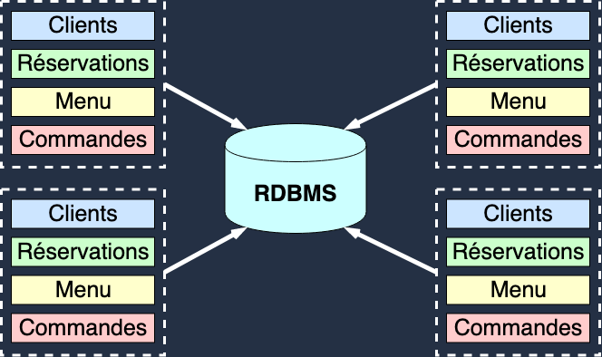
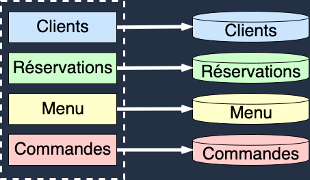
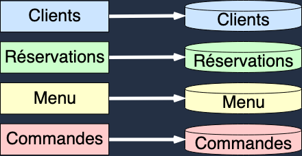
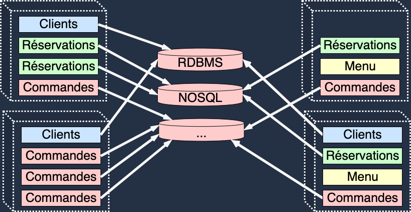
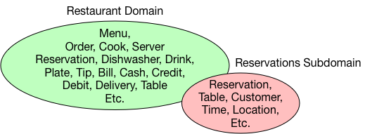

<!-- .slide: data-background="#142D38" -->
## Microservices

Note:
- Premi&egrave;re pr&eacute;sentation en fran&ccedil;ais
- Remercier Techno-Drink de m'accueillir aujourd'hui pour faire cette pr&eacute;sentation
- Revenons au sujet principal
- Le terme Microservice est en vogue
- Qu'est-ce qu'un microservice?
- Le sujet est assez vaste, mais s'efforcer de couvrir les grands fondamentaux
- 2mn

---

Note:
- Rentrons dans le vif du sujet.
- Tout d'abord: ni compl&egrave;tement monolitique ou purement orient&eacute; microservice
- raisonner en terme de valeurs absolues
- prendre des d&eacute;cisions en fonction de principes plut&ocirc;t qu'en fonction de ce qui est bon pour le produit.  
- Chaque choix que vous faites vous permettra de vous d&eacute;placer dans ce spectre
- Garder juste en t&ecirc;te qu'il n'y a pas de solution parfaite. Tout est affaire de compromis, et de pragmatisme.

---
## Monolithe: Caract&eacute;risques

- Couplage fort
- D&eacute;ploiement unitaire ("Big Bang")
- Manque d'orthogonalit&eacute; (Syndrome de la pelote de laine)
- Cycle de d&eacute;veloppement longs
- Communication synchrone
- Con&ccedil;u autour de ressources critiques partag&eacute;es
- ...
  
Note:
- Un monolithe est caract&eacute;ris&eacute; principalement par le haut degr&eacute; de couplage qui existe entre les composants qui le constitue.
- Il ne comporte pas for&eacute;ment tous ces aspects, mais ces derniers sont caract&eacute;ristiques des monolithes.
- Ce degr&eacute; de couplage peut avoir plusieurs cons&eacute;quences:
  - un mode de &eacute;ploiment unitaire. qui n&eacute;cessite le re-d&eacute;ploiement de l'ensemble des composants &agrave; chaque fois qu'un changement est introduit. (Composants ne peuvent &ecirc;tre d&eacute;ploy&eacute;s ind&eacute;pendament les uns des autres).
  - un manque d'orthogonalit&eacute;: Helicoptere
  - des cycles de d&eacute;veloppement longs.

- **Distributed Monolith**:
- Le partage de ressources critiques entre diff&eacute;rents services
- L'impossibilit&eacute; de d&eacute;ployer un service sans en d&eacute;ployer d'autres
- Incapacit&eacute; de pr&eacute;venir la propagation d'erreurs issues d'un service dane le reste du syst&egrave;me dont il fait parti
- ...

---
## Scaling

Note:
- Comme dis plus t&ocirc;t, les composants d'un monolith ne peuvent pas &ecirc;tre d&eacute;ploy&eacute; ind&eacute;pendament des autres.
- Par conc&eacute;quent, scaler un monolithe revient &agrave; d&eacute;ployer plusieurs instances de ce dernier.
- Chaque instance est ind&eacute;pendante et ne communique pas avec les autres instances du monolithe.
- Afin de garder l'ensemble consistent, les ressources critiques sont partag&eacute;es comme c'est le cas ici avec la base de donn&eacute;es.

---
## Avantages
- Simple &agrave; maintenir
- Simple &agrave; d&eacute;ployer
- Simple &agrave; exploiter
- Simple &agrave; "scaler"

Note:
- Ce type d'architecture comporte certains avantages:
 - Si le code du monolith est contenu dans un m&ecirc;me projet, les refactorings impliquant plusieurs modules sont plus simples
 - Il est &eacute;galement plus simple de maintenir le systeme consistent si les instances partagent la m&ecirc;me source de donn&eacute;es (le r&eacute;sultat d'une &eacute;criture faite dans l'une des instances, sera tout de suite disponible pour les autres instances)
 - Le d&eacute;ploiement peut &ecirc;tre &eacute;galement plus simple (dans le cas d'une seule archive)
 - Exploitation plus simple
 - Plus facile &agrave scaler

---
## Inconv&eacute;nients

- Limit&eacute; &agrave; la capacit&eacute; d'une machine
- Manque de flexibilit&eacute;
- Propagation d'erreur
- Changement difficile &agrave; int&eacute;grer

Note:
- Components must be scaled as a group.
- Deep coupling leads to inflexibility.
- Cascading Failures
- Development is typically slow (change is difficult, build times long).

---

<!-- .slide: data-background="#066FA1" -->
## Microservices

Note:
- Passer du monolithe au microservice n&eacute;cessite d'augmenter le niveau d'isolation entre les composants du syst&egrave;me

---
## Service Oriented Architecture (SOA)

Note:
- Une premi&egrave;re &eacute;tape est d'isoler l'&eacute;tat de chaque composant
- L'&eacute;tat de chaque composant est encapsul&eacute;e (API)
- Services may live in the same process (monolith) or separate (microservices).

---
## Microservices

Note:
- Les microservices introduise un degr&eacute; d'isolement supp&eacute;rieur
- Sous-Ensemble de l'approche SOA
- Chaque composant est isol&eacute; et peut &ecirc;tre d&eacute;ploy&eacute; ind&eacute;pendament et dispose de son propre sch&eacute;ma de donn&eacute;e
- En cela, les microservices adoptent une approche auto-g&eacute;r&eacute;e

---

## Scaling

Note:
- Each microservice is scaled independently.
- Could be one or more copies of a service per machine.
- Each machine hosts a subset of the entire system.

---

## Organisation

- N&eacute;cessite des changements organisationnels.
- Les &eacute;quipes sont plus ind&eacute;pendantes.
- Coordination moins n&eacute;cessaire entre les &eacute;quipes.
- Gains de productivit&eacute;.
- Organisation plus "scalable".

---
## Avantages

- Chaque composant peut scaler &agrave; la demande et ind&eacute;pendament.
- Confinement des erreurs
- Couplage faible, architecture plus flexible
- Capable d'int&eacute;grer diff&eacute;rents langages/technologies
- Cycle de d&eacute;ploiement court (possiblement continue)

---

## Inconv&eacute;nients

- Exploitation possiblement complexe (DevOps)
- N&eacute;cessite une strateg&eacute; de migration d'API
- Peut fortement impacter l'organisation de l'entreprise (Conway's law)

> organizations design systems that mirror their own communication structure

---
<!-- .slide: data-background="#066FA1" -->
## Principes d'isolation
Note:
- As we move from Monoliths to Microservices we are introducing more isolation.
- Isolation provides reduced coupling and increased scalability.
- Reactive Microservices are isolated in:
  - State
  - Space
  - Time
  - Failure
---
## &Eacute;tat

Note:
- All access to a Microservice's state must go through its API. 
- No backdoor access via the database.
- Allows the microservice to evolve internally without affecting the outside.
---
## Espace

Note:
- Microservices should not care where other microservices are deployed.
- It should be possible to move a microservice to another machine, possibly in a different data center without issue.
- Allows the microservice to be scaled up/down to meet demand.
---
## Temps

Note:
- Microservices should not wait for each other. Requests are asynchronous and non-blocking.
  - More efficient use of resources. Resources can be freed immediately, rather than waiting for a request to finish.
- Between microservices we expect eventual consistency.
  - Provides increased scalability. Total consistency requires central coordination which limits scalability 
    (more on this later).
---

## Erreur

Note:
- Reactive Microservices also isolate failure.
- A failure in one Microservice should not cause another to fail.
- Allows the system to remain operational in spite of failure.

---
<!-- .slide: data-background="#066FA1" -->
## Impl&eacute;mentation

Note:
- Un syst&egrave;me con&ccedil;u &agrave; partir de microservices n&eacute;cessite un d&eacute;coupage clair
- Chaque microservice doit donc avoir une responsabilit&eacute; propre et une API clairement d&eacute;finie.
- D&eacute;finir ce p&eacute;rim&egrave;tre peut s'av&eacute;rer difficile.
- Core problem: What is a microservice? We have to figure out what each service is, how big is it, what responsibilities does it have.

---
## Single Responsibility Principle

> A class should have only one reason to change.

**Robert C. Martin**

---

## Domain Driven Design (DDD)

- Ensemble de techniques permettant de d&eacute;composer un probl&egrave;me complexe en un ensemble de sous-probl&egrave;mes plus simples.
- **Objectif**: Cr&eacute;er une repr&eacute;sentation du probl&egrave;me compr&eacute;hensible &agrave; la fois par les experts m&eacute;tier et les d&eacute;velopeurs.

Note:
- Le DDD est un ensemble de techniques de briser un probl&egrave;me complexe en un ensemble de sous-probl&egrave;mes plus simples
- Le but est de cr&eacute;er une repr&egrave;sentation du probl&egrave;me ou du plut&ocirc;t du domaine m&eacute;tier compr&eacute;hensible &agrave; la fois par les experts m&eacute;tier et les personnes charg&eacute;es de leur fournir une solution.

---

## D&eacute;finitions

- **Domaine**: Un champ de connaissance
- **Experts M&eacute;tier**: Toute personne impliqu&eacute; dans le domaine
- **Champ lexical (Ubiquitous Language)**: Language utilis&eacute; par les experts pour parler du domaine

Note:
- Dans le contexte du logiciel, definir le domaine revient a definir le metier que l'on cherche a representer.
- Les experts metiers sont les personnes a meme de parler du domaine. Prendre l'exemple du restaurant
- Le champs lexical est le language utilise par les experts pour parler du domaine entre eux.

---

## Champ lexical

- La cr&eacute;ation du mod&egrave;le n&eacute;cessite une communication entre les experts et les d&eacute;veloppeurs
- Une terminologie doit donc &ecirc;tre d&eacute;finie par les experts et utilis&eacute;e lors de l'impl&eacute;mentation du mod&egrave;le.
- **Objectif**: Permettre aux experts et aux d&eacute;veloppeurs d'avoir une conversation &agrave; propos du domaine sans utiliser des termes li&eacute;s aux logiciel.

Note:

- Terminology in the *Ubiquitous Language* comes from the domain experts.
- Words originate in the domain and are used in the software.
- Avoid taking software terms and introducing them into the domain.
- Chaque sous-domaine comporte son propre champ lexical
- Au sein d'un sous-domaine, la d&eacute;finition d'un terme est toujours la m&ecirc;me
- Problem space VS Solution Space

---

## Bounded Context

- _Bounded context_: Espace tangible au sein duquel un terme comporte toujours la m&ecirc;me d&eacute;finition.

---
## D&eacute;fi

- Culture DevOps
- Changements organisationels
- Acceptation des lois des syst&ecirc;mes distribu&eacute;s (Amdahl, Gunter, ...)

---
<!-- .slide: data-background="#066FA1" -->
## Conclusion
---

## Recap
- Monolith VS Microservices
- Principes d'isolation: &Eacute;tat, Espace, Temps, Erreurs
- Domain Driven Design: Champ lexical, _bounded context_
---
## Pour aller plus loin

- Consistence &eacute;ventuelle VS Consistence forte
- Communication synchrone VS asynchrone
- CQRS

Note:
- Allusion a l'example de la foret
- Loi de la physique (le temps qu'une information arrive, elle sera peut etre deja obsolete)
- La consistence forte
- Sync VS Async
- Transaction distribu&eacute; -> Saga

---
- **Applied Akka Patterns** par Michael Nash et Wade Waldron
- **Designing Data Intensive Application** par Martin Kleppman
- **Reactive Design Patterns** par Roland Khun, Brian Hanafee et Jamie Allen
- **Functional and Reactive Domain Modeling** par Debasish Gosh
- **vaughnvernon.com** (DDD)
- [Lightbend Reactive Architecture](https://cognitiveclass.ai/learn/reactive-architecture-foundations) (Cognitiveclass)
---

Merci ! Questions ? 
francis.toth@yoppworks.com

---

## Strong Consistency

> An update to a piece of data needs agreement from all nodes before it becomes visible.

---

## Eventual Consistency

> Eventual consistency guarantees that, in the absence of new updates, all accesses to a specific piece of data
> will eventually return the most recent value.