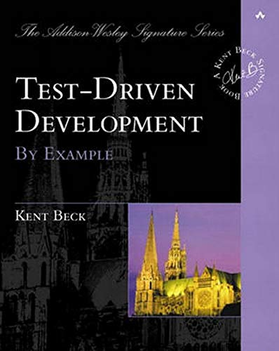

## How I learned to stop worrying and love Functional Design

---
## How I learned to stop worrying and love Functional Design

Note:
- Software design is hard but doesn't have to be. 
- 15 years ago, my mentor made me realize how much maintainable and sustainable design matters. Not only for economical reasons but also for the sake of my own mental health.

---





Note:
- So as a young and junior developer I decided to study this craft and read pretty much anything I could get my hands on. Robert Martins, Sandy Metz, Joshua Bloch, Kent Beck, Andrew Hunt and some others were my favorite authors at that time.
- However, several years later, I realized that despite all this studying I was still spending a significant amount of time figuring out how to write code as described by my initial mentor.
- In fact, I ended up too often taking shortcuts or blindly applying all these principles and best practices.

---
<br/>

Note:
- The problem is that one cannot get these guidelines right as long as their essence is not properly understood. And this is something we tend to forget when teaching design. Too often, we tend to overwhelm people with dozens and dozens of principles and best practices without conveying what ties them all together.
- If you think about it, all these practices and paradigms share some common ideas forming the fundamental set of guidelines needed to write sustainable code.
- In the next slides, we'll attempt to sum up these ideas and come up with three fundamental principles.

---

```scala []
def incByOne(i: Int): Int = /* ... */
```
```console
scala> (incByOne(0), incByOne(1))
res0:  (Int, Int) = (1, 2)
```
```console
scala> (incByOne(3), incByOne(1))
Incrementing 3!
res0:  (Int, Int) = (4, 2)
```
<!-- .element: class="fragment" data-fragment-index="2" -->
```scala []
val x = (incByOne(7), incByOne(10))
println(x) // Can we replace `x` by `(8, 11)`?
```
<!-- .element: class="fragment" data-fragment-index="3" -->
Note:
- `incByOne` is a function taking an `Int` and returning another one
- Given its behavior at runtime, we can assume it actually increments the integer it's provided with and returns it.
- Now `incByOne` could be implemented in different ways, using bit-wise operators or simply the addition operator.
- Do we really care about it? Not really. All we care about in this case is that `incByOne` does what it claims.
- In which situation would we care about its implementation however?
- Well we would care if given some specific arguments, `incByOne` would do something that is not captured by its signature.
-Like for example outputting a string on the console given a 3
- What would be the implications of such behavior?
- Well, we would not be able anymore to precisely tell how `incByOne` behaves at runtime without looking at its internals.
- As a direct consequence we loose refactoring capabilities. So for example, we would no longer be able to replace `x` by `(8, 11)` and be 100% sure that the program outputs the same result than before the refactoring.
- In other words, we cannot rely solely on `incByOne`'s signature to forecast its behavior at runtime.

---

```scala [1-3|4-7|8-12|13-17]
def foo(number: Int): Boolean =
  if(number == 42) true else false

val x     = foo(42)
// Are these equivalent?
val prog1 = (x, x)
val prog2 = (foo(42), foo(42))

def bar(number: Int): Boolean = {
  println("Checking number")
  if(number == 42) true else false
}

val y     = bar(42)
// Are these equivalent?
val prog3 = (y, y)
val prog4 = (bar(42), bar(42))
```

Note:
- Describe `foo`'s inputs and outputs and show the equivalence.
- Describe `bar`'s inputs and outputs, mention the side-effect
- A Side-Effect is created whenever a function requires an input which is not part of its argument list and/or produces an output which is not captured by its result's type.
- A call to `bar` cannot be replaced by the value it produces.
- In other words, we cannot solely rely on `bar`'s signature to tell how it behaves at runtime. Just like `incByOne` earlier.
- In contrast with `bar` and `incByOne`, functions such as `foo` have an interesting property. They can be **reasoned about locally**.

---

> **Local Reasoning** enables a reader to make sense of a function without looking at how it's implemented

Note:
- In other words, a function than can be locally reasoned about is one which inputs and outputs are all captured respectively by its arguments list and returned type.

---
## Local Reasoning

```scala
def unsafeRun(): Int               = /* ... */
def safeRun()  : Try[Option[Int]]  = /* ... */

try {
  // Who knows what may happen when calling unsafeRun???
  if(unsafeRun() == null) { /* ... */ } 
  else { /* ... */ }
} catch (Exception ex) { /* ... */ }

// In contrast, to extract this Int, I have no other option
// than dealing with potential errors and/or absence of result
val result: Try[Option[Int]] = safeRun() 
```

- Prevents mental juggling
- Provides better guarantees
- Fundamental principle of abstraction
- Similar principle than **Referential Transparency**

Note:
- **Local Reasoning** is a critical notion any developer should understand and has some interesting qualities
- First, a call to a function having this property prevents the reader to mentally picture the state of a program to reason about it.
- Secondly, it provides better guarantees about a function's behavior at runtime as inputs and outputs are all captured by the function's signature
- A function that cannot be locally reasoned about is also one which cannot be abstracted over, and used to build more complex components.
- A good analogy is language. For example, you don’t need to explain how a car works every time you want to talk about one.
- The word "car" conveys enough meaning to let us combine it with other words to express more complex concepts (eg. a sport car)
- **Local Reasoning** is therefore the fundamental principle of abstraction which is absolutely critical when it comes to build more complex software. (ex of the high level api, no need to understand the low-level api to reason about it).
- Local Reasoning is also close to the definition of Referential Transparency which defines an expression, like a function, that can be replaced by the value it produces and vice versa without changing the program's behavior. 

---
## Local Reasoning Applied

- Requires getting rid of:
  - exceptions
  - nulls
  - side-effects/statements (`println`, `readLine`, ...)
- ...effects are always required though!  <!-- .element: class="fragment" data-fragment-index="2" -->

Note:
- Local Reasoning is an awesome concept but can be confusing when applied to real-world programs.
- If you think about it, it prevents us from using exceptions, nulls and side-effects in general.
- The problem is that no matter how a program is designed, at some point it will have to perform some effect to read data from the console, call an http service, store some data in the file system.
- So the whole question is how can we reconcile Local Reasoning with that.

---
## Managing Side-Effects

```scala []
def program(): Unit = {
  val name = readLine()
  println("Hi " + name + "!")
}
```
```scala [1,4|6-7|12-15|2-3,9-10|17]
class IO[A](val unsafeRun: () => A) { self =>
  def andThen[B](f: A => IO[B]): IO[B] = 
    chain(self, f)
}

def putStrLn(s: String): IO[Unit]   = new IO(() => println(s))
def getStrLn           : IO[String] = new IO(readLine)

def chain[A, B](io: IO[A], f: A => IO[B]): IO[B] = 
  new IO(() => f(io.run()).run())

val program: IO[Unit] =
  getStrLn.andThen(name =>
    putStrLn("Hi " + name + "!")
  )

program.unsafeRun() // performs side effects
```
<!-- .element: class="fragment" data-fragment-index="3" -->

Note:
- In this example, `program` is a function which, according its signature, does not require any input and which does not generate any output. So Considering its signature, `program` does not seem to do anything really.
- However, if we look at its implementation, it reads an input from the console with `readLine`, concatenates it to a `String`, and prints it out on the console. So `program` has actually one input and one output.
- But this is nowhere mentioned in its signature, and whenever you see a function defined like this, you can 99% sure that it's actually a statement, that is a function with side-effects.
- So `program` cannot be reasoned about locally, does not guarantee anything about its behavior at runtime, and is therefore unsafe to run.
- Let's see how `program` could be made safe again.

- By nature, a statement is eager, non-deterministic (as anything could happen at runtime), and cannot be replaced by the value it produces.
- This goes in contrast with values which are lazy, deterministic and interchangeable. 
- So the trick here is to bring statements back to the world of values.
- Let's therefore create a model representing each of these statements.
- `IO` is a wrapper for what could be defined as a lazy value of type `A`
- It enables us to define values representing respectively a `println` and a `readLine`
- Using these two statements we can define the same program than before but we need however a way to sequence them. This is provided by the `chain` combinator which takes the result of the current `IO` and pipes it to a function returning another `IO`
- If we think about it, all we get so far is a data-structure describing what the program should do.
- In order to execute it, we have to call `unsafeRun` which performs all the side-effects required by this program to produce a value.
- What have we done here? We made a clear distinction between the program's declaration and its execution.
- The declaration is locally reasonable, while its execution is not. As we saw it earlier, Local Reasoning gives some super powers which are lost as soon as we execute side-effects, this tells us something about where side-effects, and more generally the execution of a program, should be done, that is at the edges of the program's architecture.

---
## Separate the what from the how 


- Keep the core locally reasonable, or **Pure**
- Delay execution until it's absolutely needed
- Separate a program's declaration from its execution

Note:
- What do we mean by edges? Well, in a program, there are usually two main sections. The business logic or the core, which is prone to change a lot, and the infrastructures executing it, like an HTTP layer or a File system, which are pretty static.
- The business logic should be always easy to reason about while being agnostic of how it is used, or in other words, executed.
- As beyond the execution point nothing can be assumed about a given function, we'd rather delay the moment when side-effects have to be be run as much as possible. Once this moment has been reached, we got to what is referred to as the edges of an application.
- So in order to keep the business logic locally reasonable or pure, we delay its execution until it's absolutely needed.
- So how do we reconciliate side-effects with local reasoning, simply by separating these two concerns properly.
- We keep the declaration of the business logic side-effect free, and leave the execution details to the edges of the architecture.

---
## IO Revisited

```scala []
class IO[A](val unsafeRun: () => A) { /* ... */ }

val a: IO[Int] = ???
val b: IO[Int] = ???

a == b // ???
```
```scala []
def putStrLn(s: String): IO[Unit]   = /* ... */
def getStrLn           : IO[String] = /* ... */

val p1: IO[Unit] = getStrLn.andThen(name => putStrLn(s"Hi $name!"))
val p2: IO[Unit] = putStrLn("Hi Bob!")
```
- Functions cannot be inspected nor compared
- `IO` only provides the last computed value

Note:
- Let's get back a bit to `IO`
- `IO` enables us to bring statements back to the safe world of values but this comes with a limitation
- If you think about it, an `IO` is nothing more than a data-structure wrapping a function potentially having side-effects.
- Because functions cannot be compared, we cannot know for sure if two `IO`s are equivalent or not.
- From a testing perspective, this is quite bad because it prevents us from comparing two different `IO`s unless we execute them.
- Secondly, we cannot know if an `IO` results from a combination of multiple functions or not.  The only guarantee provided by an `IO` is the type of value produced once it is executed successfully.
- Therefore, there is no way to know if in this example, `p1` is equivalent to `p2` or not.
- So `IO` is a good first step to achieve local reasoning but is clearly not enough.

---
## IO Revisited

```scala [1-4|6,9|10-12,20|18-19|7-8,14-16]
def program(): Unit = {
  val name = readLine()
  println("Hi " + name + "!")
}

sealed trait IO[A] { self =>
  def andThen[B](f: A => IO[B]): IO[B] =
    Chain(self, f)
}
object IO {
  case object GetStrLn            extends IO[String]
  case class  PutStrLn(s: String) extends IO[Unit]
  
  case class  Chain[A, B](
    io: IO[A], f: A => IO[B]
  ) extends IO[B]

  def getStrln           : IO[String] = GetStrLn
  def putStrln(s: String): IO[String] = PutStrLn(s)
}
```
<!-- .element: class="noStretch" -->

Note:
- Let's try another approach. This time  instead of representing each instruction in terms of a function, we'll provide a data-structure.
- We first convert `IO` to a trait.
- This trait is implemented by each data-structure representing an instruction of the IO API.
- To make it a bit more user friendly, we also provide functions which only purpose is to instantiate the data-structures we've just created.
- Finally, we provide the same sequencing ability than with the previous implementation, However instead of relying on a function, we rely this time on a data-structure again to represent the sequence of two instructions.

---
## IO Revisited

```scala [1-4|5|6|8|9,13|10-11|12]
val program: IO[Unit] = 
  getStrln.andThen(name => 
    putStrln(s"Hi $name!")
  )
// AndThen(GetStrLn, String => PutStrLn)
run(program)

def run[A](program: IO[A]): A = 
  program match {
    case GetStrLn      => readLine()
    case PutStrLn(s)   => println(s)
    case Chain(c, f)   => run(f(run(c))) // not stack safe!!
  }
```
- The resulting program is a nested data-structure
- A separate function is used to fold it into a value

Note:
- The resulting program is therefore a nested data-structure, that can be inspected, traversed, and even optimized if needed, which is exactly what we need to tell if two `IO` are equivalent or not. without executing any side-effects.
- Now at the end of the day, this data-structure does not do much on its own. It's just a simple value.
- To execute the program, we'll actually need an interpreter, that is another function which only purpose is to fold the program into a value and to perform any side-effect that may be required to do so.
- This interpreter inspects the provided program, and attempts to match it against every possible patterns.
- Note that the `Chain` case may throw a StackOverflow exception if the program is recursive. In a real-world codebase, this would have to be fixed using Trampolining, which we won't cover for the sake of time.
- In any case, this allows us to keep a clean separation between the description of the program, that is the 'what' and its execution details, that is the 'how' while also providing inspection and optimization capabilities to the API.
- A good way to think about this approach is to think in terms of programming languages where the language gives you the building blocks to describe a program, and where the compiler acts as an interpreter.

---

```scala [1,22|3-5,10-13,18-20|7-8,15-16]
class IO[A](val unsafeRun: () => A) { /* ... */ }

// primitives / constructors
def putStrLn(s: String): IO[Unit]   = new IO(() => println(s))
def getStrLn           : IO[String] = new IO(readLine)

// operators
def chain[A, B](io: IO[A], f: A => IO[B]): IO[B] = /* ...*/

// primitives
sealed trait IO[A] { /* ... */ }
case object GetStrLn               extends IO[String]
case class  PutStrLn(s: String)    extends IO[Unit]

// operators
case class  Chain[A, B](/*...*/)   extends IO[B]

// constructors
def getStrln           : IO[String] = GetStrLn
def putStrln(s: String): IO[String] = PutStrLn(s)

def run[A](program: IO[A]): A = /* ... */ 
```
<!-- .element: class="noStretch" -->

Note:
- Despite being different, these two encodings happen to have many similarities.
- Both approaches makes the distinction between the what and the how, but in one case we embed the solution evaluation function in the data-structure itself, while we keep it apart in the second case.
- Secondly, solutions or primitives are expressed differently in each case. The first approach represents solutions in terms of the evaluation function, while the second one relies on pure data-structures implementing a common trait.
- In each case, solutions are instantiated using specific functions that can be seen as constructors.
- Finally, both encodings provide combination capabilities using the `chain` operator, but note however that in one case it is modeled using the evaluation function while in the other case, we use a data-structure.

---
## Encodings

- **Executable Encoding**:
 - the evaluation function is embedded in the solution
 - operators and primitives are expressed in terms of their execution
- **Declarative Encoding**:
 - the evaluation function is extracted from the solution
 - operators and primitives are expressed as pure data

Note:
- These two encodings refer respectively to executable and declarative encodings.
- They are equivalent but each has its pros and cons.
- The executable encoding is usually simpler for new comers, and is also easier to implement in a legacy codebase. As all constructors and operators are expressed in terms of the evaluation function, adding new constructors and operators is pretty simple.
- However, adding a new evaluation function is hard, as it requires to modify every existing constructor and operator.
- In contrast, the declarative encoding is very flexible when it comes to add new evaluation functions without modifying any existing constructor, operator or primitives. However it struggles a bit when new primitives, and operators need to be added as it requires changing every existing evaluation functions.
- For those familiar with it, you may recognize the expression problem here which is particularly well illustrated by the differences between OOP and FP.

---
## Composition

- **Primitives** &nbsp;&nbsp;&nbsp;&nbsp;&nbsp;&nbsp;&nbsp;: model solutions for _simple problems_
- **Operators** &nbsp;&nbsp;&nbsp;&nbsp;&nbsp;&nbsp;&nbsp;: transform/combine existing solutions
- **Constructors** : build solutions

Note:
- Despite their differences, both encodings are built upon similar constructs.
- They both model the domain in terms of primitives, operators and constructors.
- If you've been in this industry for some time, you may recognize a pattern here which is common to every highly composable APIs like joda Time, Collections APIs in general, Rules engines, and even Functions API.
- Composition along with Local Reasoning and Purity, is the third most important principle an API should have.
- If you think about it, building a software consists of creating small simple blocks and combining them using operators to build bigger blocks.
- This is the essence of composition. However, this cannot be achieved if you cannot abstract over these blocks. Hence why Local Reasoning and Purity are so critical.
- So Composition is based on these fundamentals and is what will let an API to be decomposed and recomposed to introduce new business requirements or to modify existing ones.

---
## Composition Pro tips

```scala[2-3|2-4|2-5|7-8|10-11]
/*
- Primitives should be:
  - Composable: to build bigger blocks from smaller ones
  - Orthogonal: to prevent overlap in terms of capabilities
  - Minimal   : in terms of number

- An operator should be binary and return the same type than 
  its arguments

- Look for sum/product composition patterns (eg. zip, zipWith, 
  either, eitherWith, both, bothWith...)
*/
```

---
## Recap

- **Local Reasoning**: Provides abstraction capabilities 
- **Purity**: Ensures the core logic is context agnostic
- **Composition**: Enables safe change management

Note:
- Today we looked at three properties which I think are critical when it comes to software design.
- Local Reasoning gives you the ability to reason about your code and to abstract over existing components so that you don't need to know their internals to understand what they do.
- Purity is how you reconcile Local Reasoning with execution details and side-effects. It's a property you cannot avoid if you want to make the core of a business application highly reusable and agnostic of how it is used.
- Finally, Composition is the end-goal of this approach. It guarantees a codebase allowing the introduction of new business requirements and/or the modification of existing ones, without having to re-write everything from scratch.
- In contrast with the vast amount of best practices and pattern available today, these are easy to keep in mind. They compose a small set of principles that can be easily reason about and illustrated. Now just like any other principle, they require experience to be completely assimilated, but I believe we should put the emphasis on these when teaching software design and prevent overwhelming people with other principles which at the end of the day all derive from the ones we've looked at tonight.

---
## References

- [Spartan program](https://www.patreon.com/jdegoes/posts)
- [What is an Effect?](https://www.inner-product.com/posts/what-is-an-effect/)
- [A Beginner-Friendly Tour through Functional Programming in Scala](https://degoes.net/articles/easy-monads)

Note:
- Adam Rosien

---
## Workshops
- [Functional Data Modeling](https://www.eventbrite.com/e/functional-data-modeling-by-john-a-de-goes-tickets-119605959645)
- [The Art of Functional Design](https://www.eventbrite.com/e/functional-design-by-john-de-goes-tickets-105437751152)
- [Domain Modeling Made Functional Online Workshop](https://www.eventbrite.it/e/domain-modeling-made-functional-online-workshop-tickets-108100012046?aff=erelexpmlt)

Note:
- Scott Wlaschin

---

## Thank you! / Questions? 

&nbsp;<br/>
<span style="font-size:23pt">Francis Toth</span> - [contramap.dev](http://www.contramap.dev)<br/>
<span style="font-size:18pt">Coding - Training - Design</span><br/>
