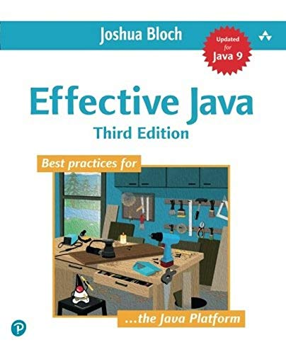
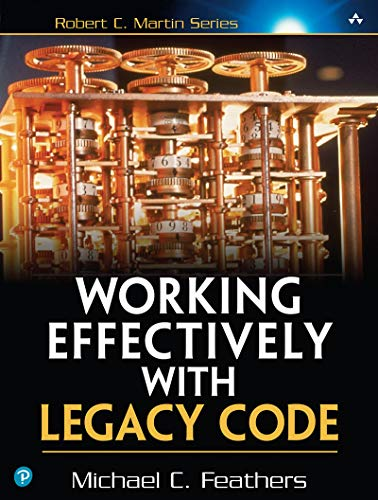
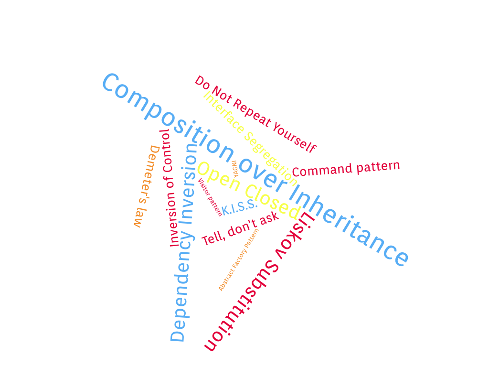

## Functional Design

---

## Functional Design

Note:
- Talk about design
- let me introduce myself

---

## Francis Toth

<div class="overflow: auto;">
  
  <p style="text-align:justify; text-justify: inter-word;">
    <ul>
      <li>Independent Software developer</li>
      <li>Remote</li>
      <li>Strongly-Typed Functional Programming</li>
      <li>Distributed systems</li>
      <li><a href="https://www.contramap.dev">www.contramap.dev</a></li>
    </ul>
  </p>
</div>

Note:
- 15+
- Mostly interested by Software Design
- Functional Programming (Scala in particular) and Strongly typed 
- 15 years ago, my mentor made me realize how much maintainable and sustainable design matters. Not only for economical reasons but also for the sake of my own mental health.

---






Note:
- So as a young, junior and ambitious developer I've decided to read pretty much anything I could get my hands on. 
- Authors such as Robert Martins, Sandy Metz, Joshua Bloch, Kent Beck, Andrew Hunt and some others were my favorite authors around at that time.
- However, several years later, I realized that despite all this studying I was still spending a significant amount of time figuring out how to write code as described by my initial mentor.
- In fact, I ended up too often dithering about what would be the best design given a problem, taking way too many shortcuts and sometime applying all these principles and best practices without really understanding what they stand for.
- I guess this is a common problem that many developers have. Writing maintainable code is indeed extremely hard if one has to follow all the principles described by these books.

---

<br/>

Note:
- The problem is that one cannot get these guidelines right as long as their essence is not properly understood. And this is something we tend to forget when teaching design. Too often, we tend to overwhelm people with dozens and dozens of principles and best practices without conveying what ties them all together.
- If you think about it, all these practices and paradigms must share some common ideas forming the fundamental set of guidelines needed to write sustainable code.
- In the next slides, we'll attempt to sum up these ideas and come up with three fundamental principles.

---

```scala []
def incByOne(i: Int): Int = /* ... */
```
```console
scala> (incByOne(0), incByOne(1))
res0:  (Int, Int) = (1, 2)
```
```console
scala> (incByOne(3), incByOne(1))
Incrementing 3!
res0:  (Int, Int) = (4, 2)
```
<!-- .element: class="fragment" data-fragment-index="2" -->
```scala []
val x = (incByOne(7), incByOne(10))
println(x) // Can we replace `x` by `(8, 11)`?
```
<!-- .element: class="fragment" data-fragment-index="3" -->
Note:
- `incByOne` is a function taking an `Int` and returning another one
- Given its behavior at runtime, we can assume it increments the integer it is provided with and returns it.
- Now `incByOne` could be implemented in different ways, using bit-wise operators or simply the addition operator.
- Do we really care about it? Not really. All we care about in this case is that `incByOne` does what it claims.
- In which situation would we care about its implementation however?
- Well we would care if given some specific arguments, `incByOne` would produce a result that is not captured by its signature.
-Like for example outputting a string on the console given a 3
- What would be the implications of such behavior?
- Well, from now on, we cannot tell how `incByOne` behaves at runtime without looking at its internals (exception, return a null, etc...)
- As a direct consequence we lose refactoring capabilities. So for example, we are no longer able to replace `x` by `(8, 11)` and be 100% sure that the program outputs the same result than before the refactoring.
- In other words, we cannot rely solely on `incByOne`'s signature to forecast its behavior at runtime.

---

```scala [1-3|4-7|8-12|13-17]
def foo(number: Int): Boolean =
  number == 42

val x     = foo(42)
// Are these equivalent?
val prog1 = (x, x)
val prog2 = (foo(42), foo(42))

def bar(number: Int): Boolean = {
  println("Checking number")
  number == 42
}

val y     = bar(42)
// Are these equivalent?
val prog3 = (y, y)
val prog4 = (bar(42), bar(42))
```

Note:
- Let's look at a different example now. Here we have a function `foo` ...
- Let's do the same with `bar`
- Nothing tells the reader of `bar`'s signature that a string will be printed out on the console once the function is called
- A side-effect is an observable interaction that a function has with its callers or the outside world besides returning a value.
- Concretely, it is created whenever a function requires an input which is not part of its argument list and/or produces an output which is not captured by its result's type.
- A call to `bar` cannot be replaced by the value it produces.
- In other words, we cannot solely rely on `bar`'s signature to tell how it behaves at runtime. Just like `incByOne` earlier.
- In contrast with `bar` and `incByOne`, functions such as `foo` have an interesting property. They can be **reasoned about locally**.

---

> **Local Reasoning** enables a reader to make sense of a function without looking at how it's implemented

Note:
- In other words, a function than can be locally reasoned about is one which inputs and outputs are all captured respectively by its arguments list and returned type.
- Or put differently, the only way a function can interact with its environment is through its argument list or by returning a value.

---
## Local Reasoning

```scala
def unsafeRun(): Int               = /* ... */
def safeRun()  : Try[Option[Int]]  = /* ... */

try {
  // Who knows what may happen when calling unsafeRun???
  if(unsafeRun() == null) { /* ... */ } 
  else { /* ... */ }
} catch {
  case ex: Exception => /* ... */ 
}

// In contrast, to extract this Int, I have no other option
// than dealing with potential errors and/or absence of result
val result: Try[Option[Int]] = safeRun() 
```
- Prevents mental juggling
- Provides better guarantees
- Fundamental principle of abstraction
- Similar principle than **Referential Transparency**

Note:
- **Local Reasoning** is a critical notion any developer should understand as it provides you with interesting properties
- First, a function having this property does not require the reader to mentally picture its outputs when calling it, or to think about dealing with 
potential outputs that are not reflected by the function's signature
- Let's the example of `unsafeRun` which is not locally reasonable. Because it cannot be locally reasoned about, I have no way to know if it will or not produce an exception, a null value or get some data from some global state, etc, etc...
- Because I do not know about this, I'll make sure that whatever calls this function is protected against these potential outputs. I have no other option since in some cases, `unsafeRun` may actually produce an output which could have disastrous consequences on the code calling it.
- So I protected myself against any potential harm. What if I forget about this?
- Well, I may introduces bugs, potentially generate inconsistencies, and get into logical branches I should never get into.
- So `unsafeRun` may be a very simple function, and we could assume that even it is not locally reasonable, we just have to open it up and figure out how it behaves. But about functions such as `unsafeRun` which are calling other functions that are not locally reasonable, which themselves call other functions such as `unsafeRun`?
- At some point, you simply get lost. You cannot picture all the possible outputs and states the initial function may generate. And this is when usually people start being afraid of modifying the function as no one really knows what it does anymore.
- Local reasoning is a solution for this issue. If all the outputs a function can generate are captured by its signature, then we will almost never have to look into it. We just have to look at its signature.
- A consequence of this, is that a locally reasonable function therefore provides you with better guarantees regarding how it will behave at runtime.
- A function that can be locally reasoned about is also one which can be abstracted over, and used to build more complex components.
- A good analogy is language. For example, you don’t need to explain how a car works every time you want to talk about one.
- The word "car" conveys enough meaning to let us combine it with other words to express more complex concepts (eg. a sport car)
- **Local Reasoning** is therefore the fundamental principle of abstraction which is absolutely critical when it comes to build more complex software.
- Finally Local Reasoning is also close to the definition of Referential Transparency which defines an expression, like a function, that can be replaced by the value it produces and vice versa without changing the program's behavior. 

---
## Local Reasoning Applied

- Requires getting rid of:
  - exceptions
  - nulls
  - side-effects/statements (`println`, `readLine`, ...)
- ...effects are always required though!  <!-- .element: class="fragment" data-fragment-index="2" -->

Note:
- Local Reasoning is a really cool concept but can be confusing when applied to real-world programs.
- If you think about it, local reasoning prevents us from using exceptions, nulls and more important side-effects in general.
- The problem is that no matter how a program is designed, at some point it will have to perform some effect to read data from the console, call an http service, store some data in the file system.
- So the whole question is how can we reconcile Local Reasoning with that.

---
## Managing Side-Effects

```scala []
def program(): Unit = {
  val name = readLine()
  println("Hi " + name + "!")
}
```
```scala [1-4|1-10|1-4,10-15]
trait Console {
  def putStrLn(s: String): Unit
  def getStrLn(): String
}

def program(console: Console): Unit = {
  val name = console.getStrLn()
  console.putStrLn("Hi " + name + "!")
}

def complexProgram(console: Console, ..., mn: ModuleN): Unit = {
  val a = foo(console, ..., mn)
  val b = bar(console, ..., mn)
  fooBar(a, b, console, ..., mn)
}
```
<!-- .element: class="fragment" data-fragment-index="2" -->

Note:
- `program` is a function which, according its signature, does not require any input and which does not generate any output. So considering its signature, `program` does not seem to do anything really.
- However, if we look at its implementation, it reads an input from the console with `readLine`, concatenates it to a `String`, and prints it out on the console. So `program` has actually one input and one output.
- But this is nowhere mentioned in its signature.
- So `program` cannot be reasoned about locally, does not guarantee anything about its behavior at runtime, and is therefore unsafe to run.
- How could we improve the `program` function?
- The first thing that may come to your mind is the introduction of a dependency
- This is typically how this problem is solved in classic OOP design.
- This indeed makes `program` a bit safer to use because we now control how side-effects are performed, however it does not make it locally reasonable.
- Secondly, this introduces a dependency which will potentially spread in subsequent computations that a more sophisticated `program` may have to perform, and as dependencies are added, the signature of these functions may grow significantly.
- The classic OOP approach is fine but has some limitations that can pretty quickly met, and this does not help with making `program` locally reasonable
- So let's think about another approach
---
## Managing Side-Effects

```scala []
def program(): Unit = {
  val name = readLine()
  println("Hi " + name + "!")
}
```
```scala [1,4|6-7|12-15|2-3,9-10|17]
class IO[A](val unsafeRun: () => A) { self =>
  def andThen[B](f: A => IO[B]): IO[B] = 
    chain(self, f)
}

def putStrLn(s: String): IO[Unit]   = new IO(() => println(s))
def getStrLn           : IO[String] = new IO(readLine)

def chain[A, B](io: IO[A], f: A => IO[B]): IO[B] = 
  new IO(() => f(io.run()).run())

val program: IO[Unit] =
  getStrLn.andThen(name =>
    putStrLn("Hi " + name + "!")
  )

program.unsafeRun() // performs side effects
```
<!-- .element: class="fragment" data-fragment-index="3" -->

Note:
- By nature, a statement is eager, non-deterministic (as anything could happen at runtime), and cannot be replaced by the value it produces.
- So how could a statement be locally reasonable?
- Well, first of all, let's keep in mind that at some point we will have to perform the side-effect defined by a statement. There is no way around that. However, we can delay its execution until it's absolutely needed.
- What needs to be understood here is that there is no problem with performing a statement, the issue is that executing one may lead to a state we do not have any guarantee about.
- So one approach is to wrap those statements in some data structure we can reason about, and use it to represent what we want to achieve.
- Let's therefore create a model representing each of these statements.
- `IO` is a data-structure wrapping a function, potentially performing side-effects and which produces an `A`
- This wrapper enables us to define values representing respectively a `println` and a `readLine`
- In order to declare the same program than before, we also need a way to sequence `IO` values.
- This is provided by the `andThen` combinator which takes the result of the current `IO` and pipes it to a function returning another `IO`
- Now, all we get so far is a data-structure describing what the program should do.
- To produce the value represented by the resulting data-structure, we have to call `unsafeRun` which performs any side-effect required to output the value.
- As long as we don't call `unsafeRun`, we keep the guarantees provided by local reasoning, along with the super-powers it provides us with. So we have control over when side-effects will be performed.
- This tells us something about where and when side-effects should be executed. 
- As nothing can be guaranteed beyond the execution of a side-effect, we should design the program so that it's always the last thing we do. And this is why, it is usually said that side-effects, and more generally, the execution of a program should be done at the edges of the program's architecture.

---
## Separate the what from the how


- Keep the core locally reasonable, or **Pure**
- Delay execution until it's absolutely needed
- Separate a program's declaration from its execution

Note:
- What do we mean by edges? Well, in a program, there are usually two main sections. The business logic or the core, which is prone to change a lot, and outer layers using it. Those outer-layers can be things like an HTTP layer, a File system or some database layer. In contrast with the core, the outer-layers are usually pretty static.
- Now, the core being the part of the software which changes the most, it is critical to keep it loosely dependent from the rest of the architecture and agnostic of any context of usage.
- The outer-layers on the other can afford a certain level of dependency as they do not require the same level of flexibility.
- So the dependency direction goes always from the outer-layers to the core.
- Earlier, I told you that because beyond the execution point nothing can be assumed about a given statement, we'd rather delay the moment when side-effects have to be run as much as possible. Once this moment has been reached, we got to what is referred to as the edges of an application. In this diagram, those edges are actually the outer-layers mentioned earlier.
- So in a nutshell, in order to keep the business logic locally reasonable or pure, we delay its execution until it's absolutely needed, and push its interpretation to the edges of the architecture. Local Reasoning and side-effects can be therefore reconciliated by simply separating these two concerns properly.

---
## IO Revisited

```scala []
class IO[A](val unsafeRun: () => A) { /* ... */ }

val a: IO[Int] = ???
val b: IO[Int] = ???

a == b // ???
```
```scala []
def putStrLn(s: String): IO[Unit]   = /* ... */
def getStrLn           : IO[String] = /* ... */

val p1: IO[Unit] = getStrLn.andThen(name => putStrLn(s"Hi $name!"))
val p2: IO[Unit] = putStrLn("Hi Bob!")
```
<!-- .element: class="fragment" data-fragment-index="2" -->
- Functions cannot be inspected nor compared
- `IO` only provides the last computed value

Note:
- Let's get back a bit to `IO`
- `IO` enables us to bring statements back to the safe world of values but this comes with a limitation
- If you think about it, an `IO` is nothing more than a data-structure wrapping a function potentially having side-effects.
- Because functions cannot be compared, we cannot know for sure if two `IO`s are equivalent or not.
- From a testing perspective, this is quite bad because it prevents us from comparing two different `IO`s unless we execute their underlying side-effects.
- Secondly, we cannot know if an `IO` results from a combination of multiple functions or not. The only guarantee provided by an `IO` is the type of the last value produced once it has been successfully executed.
- So `IO` is a good first step to achieve local reasoning but is clearly not enough.

---
## IO Revisited

```scala [1-4|6,9|10-12,20|18-19|7-8,14-16]
def program(): Unit = {
  val name = readLine()
  println("Hi " + name + "!")
}

sealed trait IO[A] { self =>
  def andThen[B](f: A => IO[B]): IO[B] =
    Chain(self, f)
}
object IO {
  case object GetStrLn            extends IO[String]
  case class  PutStrLn(s: String) extends IO[Unit]
  
  case class  Chain[A, B](
    io: IO[A], f: A => IO[B]
  ) extends IO[B]

  def getStrln           : IO[String] = GetStrLn
  def putStrln(s: String): IO[Unit]   = PutStrLn(s)
}
```
<!-- .element: class="noStretch" -->

Note:
- Let's try another approach. This time  instead of representing each instruction in terms of a function, we'll provide a data-structure.
- We first convert `IO` to a trait.
- This trait is implemented by each data-structure representing an instruction of the `IO` API.
- To make it a bit more user friendly, we also provide functions which only purpose is to instantiate the data-structures we've just created.
- Finally, we provide the same sequencing ability than with the previous implementation, However instead of relying on a function, we rely this time on a data-structure again to represent the sequence of two instructions.

---
## IO Revisited

```scala [1-4|5|6|8|9,16|10-11|12-15]
val program: IO[Unit] = 
  getStrln.andThen(name => 
    putStrln(s"Hi $name!")
  )
// AndThen(GetStrLn, String => PutStrLn)
run(program)

def unsafeRun[A](program: IO[A]): A = 
  program match {
    case GetStrLn      => readLine()
    case PutStrLn(s)   => println(s)
    case Chain(c, f)   =>
      // not stack safe!!
      val io = f(unsafeRun(c))
      unsafeRun(io)
  }
```
<!-- .element: class="noStretchW" -->
- The resulting program is a nested data-structure
- A separate function is used to fold it into a value

Note:
- The resulting program is therefore a nested data-structure, that can be inspected, traversed, and even optimized if needed.
- But because it is a data-structure, declaring it does not do much on its own.
- To execute the program, we need to call `run` which traverses the provided data-structure, and decides what should be done. So `run`'s purpose is to fold a program into a value and to perform any side-effect that may be required to do so.
- In order to do this, `run` inspects the provided program and attempts to match its structure against different patterns.
- How does this help us regarding testing, well let's see.

---
## IO Revisited

```scala []
class IO[A](val unsafeRun: () => A) { /* ...*/ }
```
```scala []
def unsafeRun[A](program: IO[A]): A = 
  program match {
    case GetStrLn      => readLine()
    case PutStrLn(s)   => println(s)
    case Chain(c, f)   =>
      val io = f(unsafeRun(c))
      unsafeRun(io)
  }
```
<!-- .element: class="fragment" data-fragment-index="2" -->
```scala []
def testRun[A](program: IO[A], state: State): (State, A) =
  program match {
    case GetStrLn     => state.popInput()
    case PutStrLn(s)  => state.pushOutput(s)
    case Chain(io, f) =>
      // not stack safe!!
      val (state0, a) = testRun(io, state)
      testRun(f(a), state0)
  }
```
<!-- .element: class="fragment" data-fragment-index="3" -->

Note:
- In the previous implementation, `unsafeRun` was embedded in the data-structure used to describe the computations to be done.
- Because of the limitations of this approach, we took a different angle and decided to define this function aside.
- Functions such as `unsafeRun` are commonly referred to as `interpreters`. They interpret the description of a computation that needs to be executed, and perform any side-effect required to produce the expected value.
- Defining the interpreter outside the data-structure enables the definition of additional interpreters which are context-specific, like for testing purpose.
- `testRun` folds an `IO[A]` without performing any side-effects, which makes it deterministic and suitable for writing tests.

- If we take some steps back, we can see now that this implementation benefits from a clean separation between the description of the program, that is the 'what' and its execution details, that is the 'how'.
- To use an analogy, what we have here is pretty much the same distinction between the building blocks used to describe a program and the compiler responsible for interpreting them

---

```scala [1,22|3-5,10-13,18-20|7-8,15-16]
class IO[A](val unsafeRun: () => A) { /* ... */ }

// primitives / constructors
def putStrLn(s: String): IO[Unit]   = new IO(() => println(s))
def getStrLn           : IO[String] = new IO(readLine)

// operators
def chain[A, B](io: IO[A], f: A => IO[B]): IO[B] = /* ...*/

// primitives
sealed trait IO[A] { /* ... */ }
case object GetStrLn               extends IO[String]
case class  PutStrLn(s: String)    extends IO[Unit]

// operators
case class  Chain[A, B](/*...*/)   extends IO[B]

// constructors
def getStrln           : IO[String] = GetStrLn
def putStrln(s: String): IO[String] = PutStrLn(s)

def unsafeRun[A](program: IO[A]): A = /* ... */ 
```
<!-- .element: class="noStretch" -->

Note:
- Despite being different, these two encodings happen to have many similarities.
- Both approaches makes the distinction between the what and the how, but in one case we embed the solution evaluation function in the data-structure itself, while we keep it apart in the second case.
- Secondly, solutions or **primitives** are expressed differently in each case. The first approach represents solutions in terms of the evaluation function, while the second one relies only on pure data-structures implementing a common trait.
- In each case, solutions are instantiated using specific functions or **constructors**.
- Finally, both encodings provide combination capabilities using the `chain` operator, but note however that in one case it is modeled using the evaluation function while in the other case, we use a data-structure.

---
## Encodings

- **Executable Encoding**:
 - the evaluation function is embedded in the solution
 - operators and primitives are expressed in terms of their execution
- **Declarative Encoding**:
 - the evaluation function is extracted from the solution
 - operators and primitives are expressed as pure data

Note:
- These two encodings refer respectively to executable and declarative encodings.
- They are equivalent but each has its pros and cons.
- The executable encoding is usually simpler for new comers, and is also easier to implement in a legacy codebase. As all constructors and operators are expressed in terms of the evaluation function, adding new constructors and operators is pretty simple.
- However, adding a new evaluation function is hard, as it requires to modify every existing constructor and operator.
- In contrast, the declarative encoding is very flexible when it comes to add new evaluation functions without modifying any existing constructor, operator or primitives.
- However it struggles a bit when new primitives, and operators need to be added as it requires changing every existing evaluation functions.
- For those familiar with it, you may recognize the expression problem here which is particularly well illustrated by the differences between OOP and FP.

---
## Composition

- **Primitives** &nbsp;&nbsp;&nbsp;&nbsp;&nbsp;&nbsp;&nbsp;: model solutions for _simple problems_
- **Operators** &nbsp;&nbsp;&nbsp;&nbsp;&nbsp;&nbsp;&nbsp;: transform/combine existing solutions
- **Constructors** : build solutions

Note:
- Now, no matter the encoding chosen, we still rely on the same building-blocks.
- In both cases, the domain is modelled in terms of primitives, operators and constructors.
- describe building blocks
- These building blocks are what enables us to introduce the third principle I'd like to cover today which is Composition.
- Composition along with Local Reasoning and Purity, is the third most important principle a codebase should have.
- If we think about it, building a software consists of creating small simple blocks and combining them using operators to build bigger blocks.
- This is the essence of composition. However, this cannot be achieved if you cannot abstract over these blocks. Hence why Local Reasoning and Purity are so critical.
- So Composition is based on these fundamentals and is what will let an API to be decomposed and recomposed to introduce new business requirements or to modify existing ones while limiting complexity.

---
## Composition

```scala []
sealed trait IO[A] { self =>
  // ...
  def fail(th: Throwable): IO[A] = IO.fail(th)
}
object IO {
  case class Fail[A](th: Throwable) extends IO[A]
  // ...
  def fail[A](th: Throwable): IO[A] = Fail(th)

  def unsafeRun[A](io: IO[A]): A =
    io match {
      // ...
      case Fail(th) => throw th
    }
}
```
```scala []
getStrLn.andThen(login =>
  if(login != "admin")
    fail(new InvalidLoginException())
  else
    putStrLn("Hi " + name + "!")
)
```

Note:
- Let's add a new primitive.
- The important thing to keep in mind when adding primitives is to prevent overlap in terms of capabilities. The less primitives are providing, the more orthogonal will be the DSL in terms of capabilities.

---
## Composition

```scala []
sealed trait IO[A] { self =>
  // ...
  def retry(n: Int): IO[A] = IO.Retry(self, n)
}
object IO {
  case class Retry[A](io: IO[A], n: Int) extends IO[A]
  // ...
  def retry[A](io: IO[A], n: Int): IO[A] = Retry(io, n)

  def unsafeRun[A](io: IO[A]): A =
    io match {
      // ...
      case Retry(io, n) =>
        try {
          run(io)
        } catch { case th: Throwable =>
          if (n <= 1) run(fail(th)) else run(Retry(io, n - 1))
        }
    }
}
```
<!-- .element: class="noStretchW noStretch" -->

Note:
- Let's add an operator now. An interesting one would be one that enables retrying when errors are encountered.
- As said earlier, an operator is a building block which transforms an existing solution or combine two existing solutions.

---
## Composition

```scala []
val program: IO[Unit] =
  getStrln.andThen(login =>
    if (login != "admin")
      fail[Unit](new RuntimeException())
    else
      putStrln("Hi " + login + "!")
  ).retry(3)
```

Note:
- With these new building blocks in our tool belt, we can now express more sophisticated program such as this one
- Now think about how would you describe the same program using a more classical or imperative approach.
- You would probably need a for-loop, a try-catch, a bunch of if-blocks, and would probably end up with a program that is 20 lines long with no way to reuse the logic you've just created.
- This approach enables you to do that and to express more powerful constructs

---
## Composition Pro tips

```scala[2-3|2-4|2-5|7-8|10-11]
/*
- Primitives should be:
  - Composable: to build bigger blocks from smaller ones
  - Orthogonal: to prevent overlap in terms of capabilities
  - Minimal   : in terms of number

- An operator should be binary and return the same type than 
  its arguments

- Look for sum/product composition patterns (eg. zip, zipWith, 
  either, eitherWith, both, bothWith...)
*/
```

---
## Recap

- **Local Reasoning**: Provides abstraction capabilities 
- **Purity**: Ensures the core logic is context agnostic
- **Composition**: Enables safe change management

Note:
- Today we looked at three properties which I think are critical when it comes to software design.
- Local Reasoning gives you the ability to reason about your code and to abstract over existing components so that you don't need to know their internals to understand what they do.
- Purity is how you reconcile Local Reasoning with execution details and side-effects. It's a property you cannot avoid if you want to make the core of a business application highly reusable and agnostic of how it is used.
- Finally, Composition is the end-goal of this approach. It guarantees a codebase allowing the introduction of new business requirements and/or the modification of existing ones, without having to re-write everything from scratch.
- In contrast with the vast amount of best practices and pattern available today, these are easy to keep in mind. They compose a small set of principles that can be easily reason about and illustrated. Now just like any other principle, they require experience to be completely assimilated, but I believe we should put the emphasis on these when teaching software design and prevent overwhelming people with other principles which at the end of the day all derive from the ones we've looked at tonight.

---
## References

- [Spartan program](https://www.patreon.com/jdegoes/posts)
- [What is an Effect?](https://www.inner-product.com/posts/what-is-an-effect/)
- [A Beginner-Friendly Tour through Functional Programming in Scala](https://degoes.net/articles/easy-monads)

Note:
- Adam Rosien

---

## Thank you! / Questions? 

&nbsp;<br/>
<span style="font-size:23pt">Francis Toth</span> - [contramap.dev](http://www.contramap.dev)<br/>
<span style="font-size:18pt">Coding - Training - Design</span><br/>
