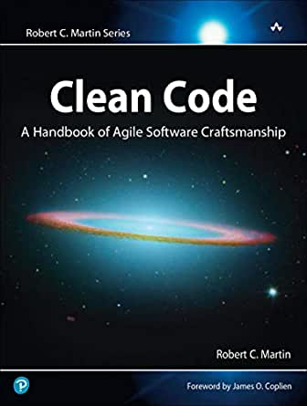
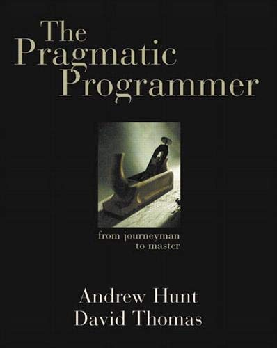
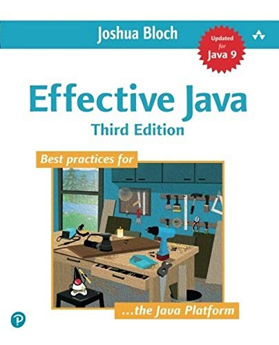
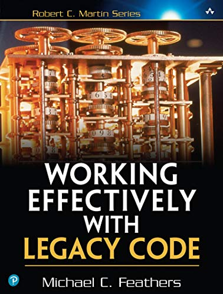
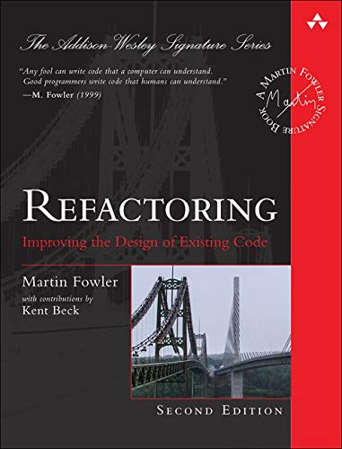
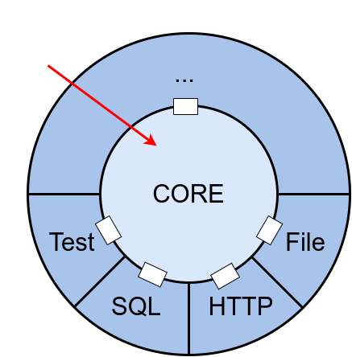

## Functional Design

---

## Francis Toth

<div class="overflow: auto;">
  
  <p style="text-align:justify; text-justify: inter-word;">
    <ul>
      <li>Independent Software developer</li>
      <li>Remote</li>
      <li>Strongly-Typed Functional Programming</li>
      <li>Distributed systems</li>
      <li><a href="https://www.contramap.dev">www.contramap.dev</a></li>
    </ul>
  </p>
</div>

---








---

<br/>

---

```scala []
def incByOne(i: Int): Int = /* ... */
```
```console
scala> (incByOne(0), incByOne(1))
res0:  (Int, Int) = (1, 2)
```
```console
scala> (incByOne(3), incByOne(1))
Incrementing 3!
res0:  (Int, Int) = (4, 2)
```
<!-- .element: class="fragment" data-fragment-index="2" -->
```scala []
val x = (incByOne(7), incByOne(10))
println(x) // Can we replace `x` by `(8, 11)`?
```
<!-- .element: class="fragment" data-fragment-index="3" -->

---

```scala [1-3|4-7|8-12|13-17]
def foo(number: Int): Boolean =
  number == 42

val x     = foo(42)
// Are these equivalent?
val prog1 = (x, x)
val prog2 = (foo(42), foo(42))

def bar(number: Int): Boolean = {
  println("Checking number")
  number == 42
}

val y     = bar(42)
// Are these equivalent?
val prog3 = (y, y)
val prog4 = (bar(42), bar(42))
```

---

> **Local Reasoning** enables a reader to make sense of a function without looking at how it's implemented

---
## Local Reasoning

```scala
def unsafeRun(): Int               = /* ... */
def safeRun()  : Try[Option[Int]]  = /* ... */

try {
  // Who knows what may happen when calling unsafeRun???
  if(unsafeRun() == null) { /* ... */ } 
  else { /* ... */ }
} catch {
  case ex: Exception => /* ... */ 
}

// In contrast, to extract this Int, I have no other option
// than dealing with potential errors and/or absence of result
val result: Try[Option[Int]] = safeRun() 
```
- Prevents mental juggling
- Provides better guarantees
- Fundamental principle of abstraction
- Similar principle than **Referential Transparency**

---
## Local Reasoning Applied

- Requires getting rid of:
  - exceptions
  - nulls
  - side-effects/statements (`println`, `readLine`, ...)
- ...effects are always required though!  <!-- .element: class="fragment" data-fragment-index="2" -->

---
## Managing Side-Effects

```scala []
def program(): Unit = {
  val name = readLine()
  println("Hi " + name + "!")
}
```
```scala [1-4|1-10|1-4,10-15]
trait Console {
  def putStrLn(s: String): Unit
  def getStrLn(): String
}

def program(console: Console): Unit = {
  val name = console.getStrLn()
  console.putStrLn("Hi " + name + "!")
}

def complexProgram(console: Console, ..., mn: ModuleN): Unit = {
  val a = foo(console, ..., mn)
  val b = bar(console, ..., mn)
  fooBar(a, b, console, ..., mn)
}
```
<!-- .element: class="fragment" data-fragment-index="2" -->

---
## Managing Side-Effects

```scala []
def program(): Unit = {
  val name = readLine()
  println("Hi " + name + "!")
}
```
```scala [1,4|6-7|12-15|2-3,9-10|17]
class IO[A](val unsafeRun: () => A) { self =>
  def andThen[B](f: A => IO[B]): IO[B] = 
    chain(self, f)
}

def putStrLn(s: String): IO[Unit]   = new IO(() => println(s))
def getStrLn           : IO[String] = new IO(readLine)

def chain[A, B](io: IO[A], f: A => IO[B]): IO[B] = 
  new IO(() => f(io.run()).run())

val program: IO[Unit] =
  getStrLn.andThen(name =>
    putStrLn("Hi " + name + "!")
  )

program.unsafeRun() // performs side effects
```
<!-- .element: class="fragment" data-fragment-index="3" -->

---
## Separate the what from the how



- Keep the core locally reasonable, or **Pure**
- Delay execution until it's absolutely needed
- Separate a program's declaration from its execution

---
## IO Revisited

```scala []
class IO[A](val unsafeRun: () => A) { /* ... */ }

val a: IO[Int] = ???
val b: IO[Int] = ???

a == b // ???
```
```scala []
def putStrLn(s: String): IO[Unit]   = /* ... */
def getStrLn           : IO[String] = /* ... */

val p1: IO[Unit] = getStrLn.andThen(name => putStrLn(s"Hi $name!"))
val p2: IO[Unit] = putStrLn("Hi Bob!")
```
<!-- .element: class="fragment" data-fragment-index="2" -->
- Functions cannot be inspected nor compared
- `IO` only provides the last computed value

---
## IO Revisited

```scala [1-4|6,9|10-12,20|18-19|7-8,14-16]
def program(): Unit = {
  val name = readLine()
  println("Hi " + name + "!")
}

sealed trait IO[A] { self =>
  def andThen[B](f: A => IO[B]): IO[B] =
    Chain(self, f)
}
object IO {
  case object GetStrLn            extends IO[String]
  case class  PutStrLn(s: String) extends IO[Unit]
  
  case class  Chain[A, B](
    io: IO[A], f: A => IO[B]
  ) extends IO[B]

  def getStrln           : IO[String] = GetStrLn
  def putStrln(s: String): IO[Unit]   = PutStrLn(s)
}
```
<!-- .element: class="noStretch" -->

---
## IO Revisited

```scala [1-4|5|6|8|9,16|10-11|12-15]
val program: IO[Unit] = 
  getStrln.andThen(name => 
    putStrln(s"Hi $name!")
  )
// AndThen(GetStrLn, String => PutStrLn)
run(program)

def unsafeRun[A](program: IO[A]): A = 
  program match {
    case GetStrLn      => readLine()
    case PutStrLn(s)   => println(s)
    case Chain(c, f)   =>
      // not stack safe!!
      val io = f(unsafeRun(c))
      unsafeRun(io)
  }
```
<!-- .element: class="noStretchW" -->
- The resulting program is a nested data-structure
- A separate function is used to fold it into a value

---
## IO Revisited

```scala []
class IO[A](val unsafeRun: () => A) { /* ...*/ }
```
```scala []
def unsafeRun[A](program: IO[A]): A = 
  program match {
    case GetStrLn      => readLine()
    case PutStrLn(s)   => println(s)
    case Chain(c, f)   =>
      val io = f(unsafeRun(c))
      unsafeRun(io)
  }
```
<!-- .element: class="fragment" data-fragment-index="2" -->
```scala []
def testRun[A](program: IO[A], state: State): (State, A) =
  program match {
    case GetStrLn     => state.popInput()
    case PutStrLn(s)  => state.pushOutput(s)
    case Chain(io, f) =>
      // not stack safe!!
      val (state0, a) = testRun(io, state)
      testRun(f(a), state0)
  }
```
<!-- .element: class="fragment" data-fragment-index="3" -->

---

```scala [1,22|3-5,10-13,18-20|7-8,15-16]
class IO[A](val unsafeRun: () => A) { /* ... */ }

// primitives / constructors
def putStrLn(s: String): IO[Unit]   = new IO(() => println(s))
def getStrLn           : IO[String] = new IO(readLine)

// operators
def chain[A, B](io: IO[A], f: A => IO[B]): IO[B] = /* ...*/

// primitives
sealed trait IO[A] { /* ... */ }
case object GetStrLn               extends IO[String]
case class  PutStrLn(s: String)    extends IO[Unit]

// operators
case class  Chain[A, B](/*...*/)   extends IO[B]

// constructors
def getStrln           : IO[String] = GetStrLn
def putStrln(s: String): IO[String] = PutStrLn(s)

def unsafeRun[A](program: IO[A]): A = /* ... */ 
```
<!-- .element: class="noStretch" -->

---
## Encodings

- **Executable Encoding**:
 - the evaluation function is embedded in the solution
 - operators and primitives are expressed in terms of their execution
- **Declarative Encoding**:
 - the evaluation function is extracted from the solution
 - operators and primitives are expressed as pure data

---
## Composition

- **Primitives** &nbsp;&nbsp;&nbsp;&nbsp;&nbsp;&nbsp;&nbsp;: model solutions for _simple problems_
- **Operators** &nbsp;&nbsp;&nbsp;&nbsp;&nbsp;&nbsp;&nbsp;: transform/combine existing solutions
- **Constructors** : build solutions

---
## Composition

```scala []
sealed trait IO[A] { self =>
  // ...
  def fail(th: Throwable): IO[A] = IO.fail(th)
}
object IO {
  case class Fail[A](th: Throwable) extends IO[A]
  // ...
  def fail[A](th: Throwable): IO[A] = Fail(th)

  def unsafeRun[A](io: IO[A]): A =
    io match {
      // ...
      case Fail(th) => throw th
    }
}
```
```scala []
getStrLn.andThen(login =>
  if(login != "admin")
    fail(new InvalidLoginException())
  else
    putStrLn("Hi " + name + "!")
)
```

---
## Composition

```scala []
sealed trait IO[A] { self =>
  // ...
  def retry(n: Int): IO[A] = IO.Retry(self, n)
}
object IO {
  case class Retry[A](io: IO[A], n: Int) extends IO[A]
  // ...
  def retry[A](io: IO[A], n: Int): IO[A] = Retry(io, n)

  def unsafeRun[A](io: IO[A]): A =
    io match {
      // ...
      case Retry(io, n) =>
        try {
          run(io)
        } catch { case th: Throwable =>
          if (n <= 1) run(fail(th)) else run(Retry(io, n - 1))
        }
    }
}
```
<!-- .element: class="noStretchW noStretch" -->

---
## Composition

```scala []
val program: IO[Unit] =
  getStrln.andThen(login =>
    if (login != "admin")
      fail[Unit](new RuntimeException())
    else
      putStrln("Hi " + login + "!")
  ).retry(3)
```

---
## Composition Pro tips

```scala[2-3|2-4|2-5|7-8|10-11]
/*
- Primitives should be:
  - Composable: to build bigger blocks from smaller ones
  - Orthogonal: to prevent overlap in terms of capabilities
  - Minimal   : in terms of number

- An operator should be binary and return the same type than 
  its arguments

- Look for sum/product composition patterns (eg. zip, zipWith, 
  either, eitherWith, both, bothWith...)
*/
```

---
## Recap

- **Local Reasoning**: Provides abstraction capabilities 
- **Purity**: Ensures the core logic is context agnostic
- **Composition**: Enables safe change management

---
## References

- [Spartan program](https://www.patreon.com/jdegoes/posts)
- [What is an Effect?](https://www.inner-product.com/posts/what-is-an-effect/)
- [A Beginner-Friendly Tour through Functional Programming in Scala](https://degoes.net/articles/easy-monads)

---

## Thank you! / Questions? 

&nbsp;<br/>
<span style="font-size:23pt">Francis Toth</span> - [contramap.dev](http://www.contramap.dev)<br/>
<span style="font-size:18pt">Coding - Training - Design</span><br/>
