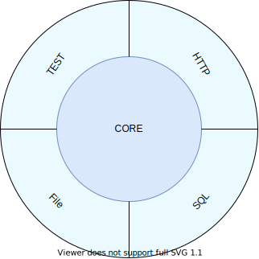

## Composition 

Note:
- Worked on a app generation engine
- Familiar with SOLID principles, but these are pretty vague
- end up over-applying them or not enough
- There must be something else, some clear practices describing how composable software design can be achieved
- This talk is about some of the things I've learnt since that time

---
## <span style="font-size:70px;">Francis Toth / Contramap.dev</span><br/>
Coding - Training - Architecture<br/>

---
> Modularity is the degree to which a system's components can be separated and recombined.

Note:
- Distinction between Modularity and Composability.
- Modularity with Android

---

- <span style="color:#88B8F7">**Modularity**</span> is about isolating modules with well-defined interfaces that can be used in a variety of contexts.
- <span style="color:#88B8F7">**Composition**</span> is the ability to combine two modules into one while providing guarantees about the resulting behavior

Note:
- Overall, it all goes back to the guarantees each of these concepts provide you with
- Modularity will guarantee that two components can be combined with each others, as long as they share a common interface. However, it does not prevent emergent behaviors, that is unexpected behaviors during runtime.
- Composability on the other hand is a stronger concept than Modularity. It provides you with the same ability but 
  also **guarantees** that no emergent behavior will be encountered at runtime.

---
## Emergent behavior

```java [1-8|9-14]
class UserService {
  private final UserDao dao;
  // ...
  public void save(User user) {
    // some validation logic
    dao.save(user);
  }
}

UserService service1 = new UserService(dao1)
UserService service2 = new UserService(dao2)

service1.save(new User(42));
service2.save(new User(42));
```
- `service` may behave differently depending on what `UserDao` is provided

Note:
- Different implementations of `UserDao` could behave differently (File, Database, HTTP)
- it could throw different exceptions, have different inputs / outputs

---
## Side-Effects

```java [1-4|5-8]
public String foo(Integer i) {
  return i.toString();
}

public String bar(Integer i) {
  System.out.println("Converting " + i + " to String")
  return i.toString();
}
```

---
## Side-Effects

- Emergent behaviors are referred to as <span style="color:#88B8F7">**side-effects**</span>
- They are created whenever:
  - an <span style="color:#88B8F7">**input**</span> is not present in a function's argument list
  - an <span style="color:#88B8F7">**output**</span> is not captured by a function's return type
- A function having side-effects is called a <span style="color:#88B8F7">**statement**</span>
- **Side-effects prevent Composition**

---
## Side-Effects: Examples

```java [1-4|5-8|9-13|14-15]
String ask(String question) {
  return "How are you?".equals(question)) ?
    "I'm ok" : null;
}

int divide(int x, int y) {
  return x / y;
}

int increment(int i) {
  Counter.total += i; // total is as a static field
  return Counter.total;
}

String readFromDisk(String filePath) { /* ... */ }
```

---
## Composition fundamentals

```java []
final int i     = 1 + 5;
//    ^---^       ^---^
//    a value     an expression producing 6
final int j     = add1(2);
//    ^---^       ^-----^
//    a value     an expression producing 3
final Foo f     = makeFoo(someArgument);
//    ^---^       ^-------------------^
//    a value     an expression producing a Foo
```
- Composition is the ability to <span style="color:#88B8F7">**combine**</span> two <span style="color:#88B8F7">**values**</span> into <span style="color:#88B8F7">**one**</span>
- A <span style="color:#88B8F7">**value**</span> is an <span style="color:#88B8F7">**immutable**</span>
piece of data resulting from an <span style="color:#88B8F7">**expression**</span>

---
## Expression and Values

```java []
final int i = 1 + 5;
final int j = add1(i);

final int k = i + j;

System.out.println(k);
```
```java []
// k could be declared like
final int k = 6 + add(1);
// or
final int k = 1 + 5 + add(6);
// or
final int k = i + add(i);
// ...
```
- An expression and the value it produces can be <span style="color:#88B8F7">**swapped**</span> without affecting the overall output
- They are <span style="color:#88B8F7">**interchangeable**</span> 

---
## Local Reasoning

- Expressing a program in terms of <span style="color:#88B8F7">**values**</span> enables <span style="color:#88B8F7">**local reasoning**</span>
- It's the ability to reason about an expression/value without looking at how it is computed
- <span style="color:#88B8F7">**Local reasoning**</span> is the fundamental principle of <span style="color:#88B8F7">**abstraction**</span>
- it enables composition of bigger blocks from smaller blocks

---
## Local Reasoning: Example

```java []
String toJson(User user) { /* ... */ }

int length(String s) { /* ... */ }

int l = length(toJson(user));
```
```java [3|1-2|1-6|1-7]
Function&lt;User, String&gt;    toJson = /* ... */;
Function&lt;String, Integer&gt; length = /* ... */;

Function&lt;String, Integer&gt; jsonLength = 
  toJson.andThen(length);

jsonLength.apply(user);
```
---
## Local Reasoning: Example
```java []
// This function makes a database call
User find(UserId userId) { /* ... */ }

// This function makes an http call
City extractCity(User user) { /* ... */ }

// Anything to watch out for when running this instruction?
City c = extractCity(find(userId(42)));
```

```java [3|1-3|1-5|1-7]
Function&lt;UserId, User&gt; find      = /* ... */;
Function&lt;User, City&gt; extractCity = /* ... */;

Function&lt;UserId, City&gt; findUserCity = 
  find.andThen(extractCity);

findUserCity.apply(userId(42));
```

Note:
- `find` may throw an exception, or return null.
- What does that imply?
- Let's convert these functions to values

---
## Local Reasoning

- <span style="color:#88B8F7">**Side-Effects**</span>:
 - prevent expressions to be converted to values
 - limit/eliminate <span style="color:#88B8F7">**Local reasoning**</span>
 - prevent <span style="color:#88B8F7">**abstracting**</span> about the code
 - ...but are a necessary evil however

Note:
- Enforcing <span style="color:#88B8F7">**Local reasoning**</span> results in establishing clear interfaces between the callee and the caller.
- No matter the program, side effects are always required
- They cannot be eliminated but they can be mitigated

---
## Statements VS Values

```java
System.out.println("Please enter your name.");
String name = System.console().readLine();
System.out.println("Hi " + name + "!");
```
- How could we make this program composable?
- The first step is to convert these <span style="color:#88B8F7">**statements**</span> into <span style="color:#88B8F7">**values**</span>

---
## Statements As Values

```java
interface Console {

  static Console putStrLn(String content, Supplier&lt;Console&gt; next) { 
    return new PutStrLn(content, next);
  }

  static Console getStrLn(Function&lt;String, Console&gt; next) { 
    return new GetStrLn(next);
  }

  static Console END = new Console() { /* ... */ };

  class PutStrLn implements Console  { /* ... */ }
  class GetStrLn implements Console  { /* ... */ }
  // ...
}
```
- Each statement is represented by a <span style="color:#88B8F7">**value**</span> (eg. `PutStrLn`, `GetStrLn`, ...)
- These can be used to model <span style="color:#88B8F7">**what**</span> the program should do

Note:
- So what can we do about this? First of all, we need to convert these statements into values.

---
## Statements As Values

```java
Console program = 
  putStrLn("Please enter your name.",
    getStrLn(name -> 
      putStrLn("Hi " + name + "!")
    )
  );
```
- Declaration of the program is side-effect free
- Resulting values can be combined further
- No more statements!
- ...but it's just a data-structure <!-- .element: class="fragment" data-fragment-index="2" -->

Note:
- We model our solution using a set of values describing what the program should do.
- These values can be combined to describe more complicated programs
- Because the program is a value, I can inspect it and ensure that it is shaped exactly as I expect it to be.
- It goes back to represent a program with something like a linked list.
---
## Live Coding

Note:
- We need an interpreter

---
## Statements As Values

- Using <span style="color:#88B8F7">**values**</span> instead of <span style="color:#88B8F7">**statements**</span> provides:
  - a <span style="color:#88B8F7">**clean separation**</span> between the declaration of a program (<span style="color:#88B8F7">**the what**</span>) and its interpretation (<span style="color:#88B8F7">**the how**</span>)
  - inspection capabilities when testing
  - better guarantees when code is executed
- Makes the code easier to compose and to reason about
 
---
## Interpreters

<br/>
- Interpreters live at the edges of the architecture
- The same business logic can be run by multiple interpreters
- It is possible to optimize them further

Note:
- Interpreters live at the edge of the world
- Follow a principle which is pretty close to the Command pattern from GoF
- The goal of this technique is to keep what changes the most (the code) as flexible/composable as possible.
- Anything that is less composable is pushed to the edges of the architecture

---
## Recap

- Composition is the ability to <span style="color:#88B8F7">**combine**</span> two <span style="color:#88B8F7">**values**</span> into <span style="color:#88B8F7">**one**</span>
- A <span style="color:#88B8F7">**value**</span> is an <span style="color:#88B8F7">**immutable**</span>
piece of data
- <span style="color:#88B8F7">**Side effects**</span> prevent composition but this can be mitigated by separating the <span style="color:#88B8F7">**declaration**</span> of a program from <span style="color:#88B8F7">**how**</span> it is executed

---
## Composition fundamental blocks

- Composable DSL are built on
  - primitives
  - constructors
  - operators

Note:
- A composable DSL is built upon three concepts: primitives, constructors and operators
- Primitives model the solution of a domain problem
- Constructors allow constructing simple solution using primitives
- Operators enable you to solve more complex problems by transforming and combining solutions for sub-problems.

---
## Primitives

- Primitives model the solutions of a domain problem
- They should be:
 - <span style="color:#88B8F7">**Composable**</span>: easy to combine to build complex solutions
 - <span style="color:#88B8F7">**Orthogonal**</span>: unique in terms of capabilities
 - <span style="color:#88B8F7">**Minimal**</span>:  in terms of the number of primitives

Note:
- Composable: Combining one primitive with another should be as simple as possible
- Orthogonal: There should no overlap between the capability of one primitive and another (SRP applied to primitives)
- Minimal: Their number should be minimal while still being enough to solve the full range of problems implied by the domain

---
## Primitives

```java
interface EmailFilter {
  static EmailFilter ALWAYS = new EmailFilter() {};

  static class Not implements EmailFilter { /* ... */ }
  static class And implements EmailFilter { /* ... */ }

  static class SenderEquals    implements EmailFilter { /* ... */ }
  static class RecipientEquals implements EmailFilter { /* ... */ }
  static class BodyEquals      implements EmailFilter { /* ... */ }
}
```

---
## Constructors

```java
static EmailFilter senderEquals(Address target) {
  return new SenderEquals(target);
}

static EmailFilter recipientEquals(Address target) {
  return new RecipientEquals(target);
}

static EmailFilter bodyEquals(String body) {
  return new BodyEquals(body);
}
```
- <span style="color:#88B8F7">**Constructors**</span> are responsible for building simple solutions for small problems using primitives

---
## Operators

```java
interface EmailFilter {
  // ...
  default EmailFilter and(EmailFilter that)    { /* ... */ }
  default EmailFilter negate(EmailFilter that) { /* ... */ }
  default EmailFilter or(EmailFilter that)     { /* ... */ }
  // ...
}
```
- <span style="color:#88B8F7">**Operators**</span> solve more complex problems by <span style="color:#88B8F7">**transforming**</span> and <span style="color:#88B8F7">**combining**</span> solutions.
- They accept and return similar types

---
## Live Coding

---
## Combining DSLs

- Composable DSLs can be combined together
- They require a common type to be reduced to.
- That's a topic for another talk :)

---
## Conclusion

- Modularity VS Composition
- Composition is about combining two values into one
- Side-Effects should be properly managed
- Composable DSL are built on primitives, constructors and operators

---
## Thank you! / Questions? 
www.contramap.dev


