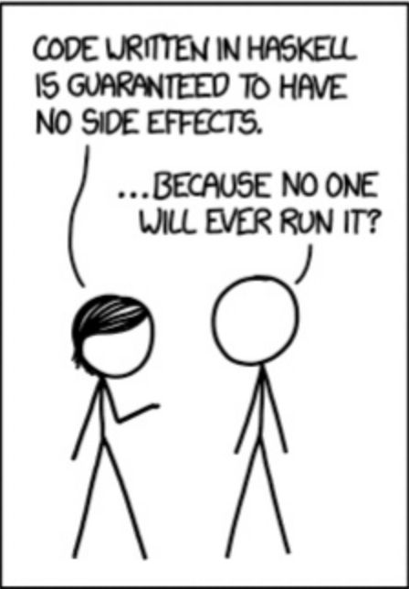

<h2 style="display: inline-block;"> Functional Programming</h2>

---
## Expression Oriented

```scala
42
x = 41 + 1
y = x * 2
z = add(x, 2)
```

```scala
x = 42
y = x + 1 == 42 + 1
```
<!-- .element: class="fragment" data-fragment-index="1" -->

```scala
x = (2 * 2) + (3 * 4)
x = 2 * 2 + 3 * 4
x = 4 + 12
x = 16
```
<!-- .element: class="fragment" data-fragment-index="2" -->

---

```scala
val add1: Int => Int = (i:Int) => i + 1
val sub1: Int => Int = (i:Int) => i - 2

def compose[A, B, C](
  f: B => C,
  g: A => B,
): A => C = { a => f(g(a)) }

val add1AndSub2 = compose(add1, sub2)
add1AndSub1(1) == 0
```
---

```scala
(Int, Int) => Int becomes Int => Int => Int
```
```scala
val sum:     (Int, Int) => Int = (x, y) => x + y
val curried: Int => Int => Int = x => (y => x + y)

curried(1)(3) == 4
```

_Currying is the technique of translating the evaluation of a function that takes multiple arguments into evaluating a sequence of functions, each with a single argument._ - Wikipedia
<!-- .element: style="font-size: 30px; text-align: left" -->
---
```scala
val f3: (Int, Int, Int) => Int =
  (x, y, z) => x + y + z

val f2: (Int, Int) => Int =
  f3(0, _, _)

f2(40, 2) == 42
```

_Partial application refers to the process of fixing a number of arguments to a function, producing another function of smaller arity_ - Wikipedia
<!-- .element: style="font-size: 30px; text-align: left" -->
---
<ul>
  <li class="fragment"><span style="color:#42BAE8"><b>Total</b></span>: A function must yield a value for <i>every</i> possible input.</li>
  <li class="fragment"><span style="color:#42BAE8"><b>Pure</b></span>: A function’s only effect must be the computation of its return value</li>
  <li class="fragment"><span style="color:#42BAE8"><b>Deterministic</b></span>: A function must yield the <i>same</i> value for the <i>same</i> input.
  <br/><br/><br/>
  <div style="text-align: right"><span style="font-size: 20px">
    Taken from <i>"A Beginner-Friendly Tour through unctional Programming in Scala"</i>.<br/><b>John A e Goes</b>.
   </span></div>
   </li>
</ul>

---
## Inputs / Outputs

```scala
def foo(number: String): Int = number.toInt

def bar(input: String): Int = { 
  println("performing bar")
  foo(input)
}
```
---
## Side Effects

```scala
def parse(integer: String): Int = {
  if(numberIsNotAString(number)) {
    throw new IllegalArgumentException(/*...*/)
  } else {
    // parsing logic returning parsed integer
  }
}
```
---
## Side Effects
```scala
def ask(question: String): String = {
  if(question == "What's the meaning of life?") {
    "42"
  else
    null // does not compile in Scala
}
```
---
## Side Effects

```scala
var n = 41
def add1(y: Int): Int = {
  n = n + 1
  y + 1
}
// ...
val m = add1(41)
assert(n == 42)
```
---
## Side Effects
```scala
def readIntegerFromFile(filePath: String): Int = { 
  // throws exceptions
  val content = readFromFile(filePath)
  // ...
}
```

---

_A function having a side-effect is a function which has an observable interaction with its calling functions or the outside world besides returning a value_ - Wikipedia.

---
```scala
// List.scala
override def drop(n: Int): List[A] = {
  var these = this
  var count = n
  while (!these.isEmpty && count > 0) {
    these = these.tail
    count -= 1
  }
  these
}
```
---


---
## Total Functions

```scala
def parse(integer: String): Int = {
  if(numberIsNotAString(number)) {
    throw new IllegalArgumentException(/*...*/)
  } else { /* parsing logic */}
}
```
```scala
def ask(question: String): String = {
  if(question == "What's the meaning of life?") {
    "42"
  else
    null // does not compile in Scala
}
```

- Total: A function must yield a value for _every_ possible input
---
## Total Functions
```scala
trait Either[A, B]
case class Left[A, B](a: A)  extends Either[A, B]
case class Right[A, B](b: B) extends Either[A, B]

def parse(integer: String): Either[Exception, Int]
```
```scala
trait Maybe[A]
case class Some[A](a: A) extends Maybe[A]
case class None[A]()     extends Maybe[A]

def ask(question: String): Maybe[String]
```

---
## Pattern Matching

```scala
case class Foo(first: String, second: Int)

Foo("bar", 42) match {
  case Foo(x, 42)    => println(s"$x == 42")
  case Foo("bar", _) => println(s"bar != 42")
  case _             => println("Default case")
}

Foo("bar", 74) match {
  case Foo(x, 42)    => println(s"$x == 42")
  case Foo("bar", _) => println(s"bar != 42")
  case _             => println("Default case")
}
```
---
## Total Functions

```scala
def ask(question: String): Maybe[String] = {
  if(question == "What's the meaning of life?") {
    Some("42")
  else
    None
}

ask("What's the meaning of life?") match {
  case Some(answer)  =>
    println(s"The answer is: $answer")
  case None          =>
    println("I cannot answer this question.")
}
```

---
## Pure Functions

```scala
var n = 41
def add1(x: Int): Int = {
  n = n + 1
  x + 1
}
// ...
val m = add1(41)
assert(n == 42)
```

- Pure: A function’s only effect must be the computation of its return value

---
## Pure Functions

```scala
def add1(x: Int, y: Int): (Int, Int) = {
  (x + 1, n + 1)
}
// ...
val n = 41
val (m, n2) = add1(41, n)
assert(n2 == 42)
```
---
## Deterministic Functions
```scala
val s: String = readInput()
printOnConsole(s)
```

- Deterministic: A function must yield the _same_ output for the _same_ input
---
            </section>
            <section data-transition="none none">
                <div style="margin-top: 60px">&nbsp;</div>
                <pre><code class="scala" data-trim data-noescape style="font-size: 1.1em; line-height: 1.2em">
trait ConsoleIO
case class Read(process: String => ConsoleIO) extends ConsoleIO
case class Write(line: String, then: ConsoleIO) extends ConsoleIO
case object End extends ConsoleIO
                </code></pre>
                <pre class="fragment"><code class="scala" data-trim data-noescape style="font-size: 1.1em; line-height: 1.2em">
val program: ConsoleIO = Read { line => Write(line, End) }
                </code></pre>
            </section>
            <section data-transition="none none">
                <div style="margin-top: 60px">&nbsp;</div>
                <pre><code class="scala" data-trim data-noescape style="font-size: 1.1em; line-height: 1.2em">
def interpret(program: ConsoleIO): Unit = program match {
  case Read(process) => interpret(process(readLine()))
  case Write(line, next) => println(line); interpret(next)
  case End => println("Done !")
}
                </code></pre>
            </section>
            <section data-transition="none none">
                <div style="margin-top: 60px">&nbsp;</div>
                <pre><code class="scala" data-trim data-noescape style="font-size: 1.1em; line-height: 1.2em">
trait ConsoleIO
case class Read(process: String => ConsoleIO) extends ConsoleIO
case class Write(line: String, then: ConsoleIO) extends ConsoleIO
case object End extends ConsoleIO

val program: ConsoleIO = Read { line => Write(line) }
interpret(program)
                </code></pre>
                <pre><code class="scala" data-trim data-noescape style="font-size: 1.1em; line-height: 1.2em">
def interpret(program: ConsoleIO): Unit = program match {
  case Read(process) => interpret(process(readLine()))
  case Write(line, next) => println(line); interpret(next)
  case End => println("Done !")
}
                </code></pre>
            </section>
        </section>

        <section data-transition="none none">
            <ul style="list-style-type: none;">
                <li><ul>
                    <li><span style="font-size: 30px;color: #42BAE8;">Total</span>: A function must yield a value for <i>every</i> possible input.</li>
                    <li><span style="font-size: 30px;color: #42BAE8;">Pure</span>: A function only effect must be the computation of its return value</li>
                    <li><span style="font-size: 30px;color: #42BAE8;">Deterministic</span>: A function must yield the <i>same</i> value for the <i>same</i> input.</li>
                </ul></li>
                <li style="list-style-type: none;">&nbsp;</li>
                <li><ul>
                    <li>Side effects break Referential Transparency :(</li>
                    <li>Side-Effects must be explicit</li>
                    <li>Separate the 'what' from the 'how'</li>
                </ul></li>
            </ul>
        </section>

        <section data-transition="none none">
            <h2>Composition</h2>
            <section data-transition="none none">
                <pre class="fragment"><code class="scala" data-trim data-noescape style="font-size: 1.1em; line-height: 1.2em">
trait Either[A, B]
case class Left[A, B](a: A)  extends Either[A, B]
case class Right[A, B](b: B) extends Either[A, B]
                </code></pre>
                <pre class="fragment"><code class="scala" data-trim data-noescape style="font-size: 1.1em; line-height: 1.2em">
val foo: Either[Exception, Int] = ???
val result = foo match {
  case Right(y) => y + 1
  case Left(ex) => ??? // what are we supposed to return here???
}
println(result)
                </code></pre>
            </section>
            <section data-transition="none none">
                <pre><code class="scala" data-trim data-noescape style="font-size: 1.1em; line-height: 1.2em">
val success: Either[Exception, Int] = Right(42)

val failure: Either[Exception, Int] =
  Left(new RuntimeException())

map( _ + 1 )(success) // returns 43
map( _ + 1 )(failure) // return failure

def map[A, B](f: A => B)
             (e: Either[Exception, A]): Either[Exception, B] =
  e match {
    case Right(v) => Right(f(v))
    case Left(e) => Left(e)
  }
                </code></pre>
            </section>
            <section data-transition="none none">
                <pre><code class="scala" data-trim data-noescape style="font-size: 1.1em; line-height: 1.2em">
val foo: Either[Exception, Int] = ???
val bar: Int => Either[Exception, String] = ???

// meh !
val fooBar: Either[Exception, Either[Exception, String]] =
  map(bar)(foo)

val fooBar: Either[Exception, String] = chain(foo, bar)
                </code></pre>
                <pre class="fragment"><code class="scala" data-trim data-noescape style="font-size: 1.1em; line-height: 1.2em">
def chain[E, B, C](f: B => Either[E, C])
                  (e: Either[E, B]): Either[E, C] = e match {
  case Right(b) => f(b)
  case Left(e) => Left(e)
}
                </code></pre>
            </section>
            <section data-transition="none none">
                <pre><code class="scala" data-trim data-noescape style="font-size: 1.1em; line-height: 1.2em">
def map[A, B](f: A => B)(m: Maybe[A]): Maybe[B] =
  m match {
    case Some(a) => Some(f(a))
    case None() => None()
  }

def chain[A, B](f: A => Maybe[B])(m: Maybe[A]): Maybe[B] =
  m match {
    case Some(a) => f(a)
    case None() => None()
  }
                </code></pre>
            </section>
            <section data-transition="none none">
                <pre><code data-trim data-noescape style="font-size: 1.2em; line-height: 1.0em">
// Algebraic data types
1, 2, 3...

// Operations
1 + 2 = 3
3 * 2 = 6

// Laws
0 + x = x
1 * x = x
                </code></pre>
            </section>

            <section data-transition="none none">
                <pre><code class="scala" data-trim data-noescape style="font-size: 1.1em; line-height: 1.2em">
def map[A, B](f: A => B)(m: Maybe[A]): Maybe[B] = m match {
  case Some(a) => Some(f(a))
  case None() => None()
}
                </code></pre>
                <pre class="fragment"><code class="scala" data-trim data-noescape style="font-size: 1.1em; line-height: 1.2em">
def noop[A](a: A): A = a
map(noop)(foo) == foo
                </code></pre>
                <pre class="fragment"><code class="scala" data-trim data-noescape style="font-size: 1.1em; line-height: 1.2em">
val f: Int => Int = ???
val g: Int => String = ???

map(compose(f, g))(foo) == compose(map(f),map(g))(foo)
                </code></pre>
            </section>

            <section data-transition="none none">
                <pre><code class="scala" data-trim data-noescape style="font-size: 1.1em; line-height: 1.0em">
trait Functor[F[_]] {
  def pure[A](a: A): F[A]
  def map[A, B](fa: F[A], f: A => B): F[A]
}               </code></pre>
                <pre><code class="haskell" data-trim data-noescape style="font-size: 1.1em; line-height: 1.0em">
# identity law
map(noop)(foo) == foo

# composition law
map(compose(f, g))(foo) == compose(map(f),map(g))(foo)
                </code></pre>
            </section>

            <section data-transition="none none">
                <pre><code class="scala" data-trim data-noescape style="font-size: 1.1em; line-height: 1.0em">
val foo: Int => Int => String = x => y => s"$x, $y"

val m1: Maybe[Int] = Some(1)
val m2: Maybe[Int] = Some(2)
                </code></pre>
                <pre class="fragment"><code class="scala" data-trim data-noescape style="font-size: 1.1em; line-height: 1.0em">
val pFoo: Maybe[Int => String] =
  map(foo)(m1) // Some(y => "1, $y")
                </code></pre>

                <pre class="fragment"><code class="scala" data-trim data-noescape style="font-size: 1.1em; line-height: 1.0em">
def ap[A, B](mf: Maybe[A => B])(ma: Maybe[A]): Maybe[B] =
  ma match {
   case Some(a) => map(f => f(a))(mf)
   case None()  => None()
  }
                </code></pre>
                <pre class="fragment"><code class="scala" data-trim data-noescape style="font-size: 1.1em; line-height: 1.0em">
val result: Maybe[String] = ap(pFoo)(m2)
                </code></pre>
            </section>
            <section data-transition="none none">
                <pre><code class="scala" data-trim data-noescape style="font-size: 1.1em; line-height: 1.0em">
trait Applicative[F[_]] extends Functor[F] {
  def ap[A, B](ff: F[A => B])(fa: F[A]): F[B]
}
                </code></pre>
                <pre><code class="scala" data-trim data-noescape style="font-size: 1.1em; line-height: 1.0em">
ap(ff)(fx) == map(f)(fx)
                </code></pre>
            </section>

            <section data-transition="none none">
                <pre><code class="scala" data-trim data-noescape style="font-size: 1.1em; line-height: 1.0em">
def chain[A, B](f: A => Maybe[B])(m: Maybe[A]): Maybe[B] =
  m match {
    case Some(a) => f(a)
    case None() => None()
  }
                </code></pre>
                <pre class="fragment"><code class="scala" data-trim data-noescape style="font-size: 1.1em; line-height: 1.0em">
val f: Int => Maybe[Int] = ???
val pure: Int => Maybe[Int] = (i: Int) => Some(i)
                </code></pre>
                <pre class="fragment"><code class="scala" data-trim data-noescape style="font-size: 1.1em; line-height: 1.0em">
chain(pure)(Some(42)) == Some(42)
                </code></pre>
                <pre class="fragment"><code class="scala" data-trim data-noescape style="font-size: 1.1em; line-height: 1.0em">
chain(f)(Some(42)) == f(42)
                </code></pre>
                <pre class="fragment"><code class="scala" data-trim data-noescape style="font-size: 1.1em; line-height: 1.0em">
val g: Int => Maybe[Int] = ???

chain(chain(Some(42), f), g)
  == chain(Some(42), i => chain(f(i), g))
                </code></pre>
            </section>
            <section data-transition="none none">
                <pre><code class="scala" data-trim data-noescape style="font-size: 1.1em; line-height: 1.0em">
trait Monad[M[_]] {
  def flatMap[A, B](ma: M[A], f: A => M[B]): M[A]
}               </code></pre>
                <pre><code class="scala" data-trim data-noescape style="font-size: 1.1em; line-height: 1.0em">
// Left identity law
chain(pure)(Some(42)) == Some(42)

// Right identity law
chain(f)(Some(42)) == f(42)

// Composition law
chain(chain(Some(42), f), g)
  == chain(Some(42), i => chain(f(i), g))
                </code></pre>
            </section>

            <section data-transition="none none">
                <pre><code class="scala" data-trim data-noescape style="font-size: 1.1em; line-height: 1.0em">
trait Functor[F[_]] {
  def pure[A](a: A): F[A]
  def map[A, B](fa: F[A], f: A => B): F[A]
}

trait Monad[M[_]] {
  def flatMap[A, B](ma: M[A], f: A => M[B]): M[A]
}

trait Applicative[F[_]] extends Functor[F] {
  def lift[A, B](ff: F[A => B])(fa: F[A]): F[B]
}
                </code></pre>
            </section>
            <section data-transition="none none">
                
                
            </section>
        </section>
        <!--16:30-->
        <section data-transition="none none">
            <h2>Conclusion</h2>
            <ul>
                <li><span style="font-size: 30px;color: #42BAE8;">Learn You a Haskell for Great Good! : </span><span style="font-size: 25px">by Miran Lipovaca</span></li>
                <li><span style="font-size: 30px;color: #42BAE8;">Functional Programming in Scala : </span><span style="font-size: 25px">by Paul Chiusano and Rúnar Bjarnason</span></li>
                <li><span style="font-size: 30px;color: #42BAE8;">http://degoes.net/: </span><span style="font-size: 25px">by John A De Goes</span></li>
                <li><span style="font-size: 30px;color: #42BAE8;">https://wiki.haskell.org/Typeclassopedia: </span><span style="font-size: 25px">by Brent Yorgey</span></li>
                <li><span style="font-size: 30px;color: #42BAE8;">Functional and Reactive Domain Modeling: </span><span style="font-size: 25px">by Debasish Ghosh</span></li>
                <li><span style="font-size: 30px;color: #42BAE8;">Real World Haskell: </span><span style="font-size: 25px">by Bryan O'Sullivan, Don Stewart, and John Goerzen</span></li>
                <li style="list-style-type: none;">&nbsp;</li>
                <li class="fragment"><span style="font-size: 30px;color: #42BAE8;">Lambda Montreal </span><span style="font-size: 25px">by reaaaallllly nice folks :)</span></li>
            </ul>
        </section>
        <section data-transition="none none">
            
            Thank you ! Questions ?
        </section>
    </div>
</div>

